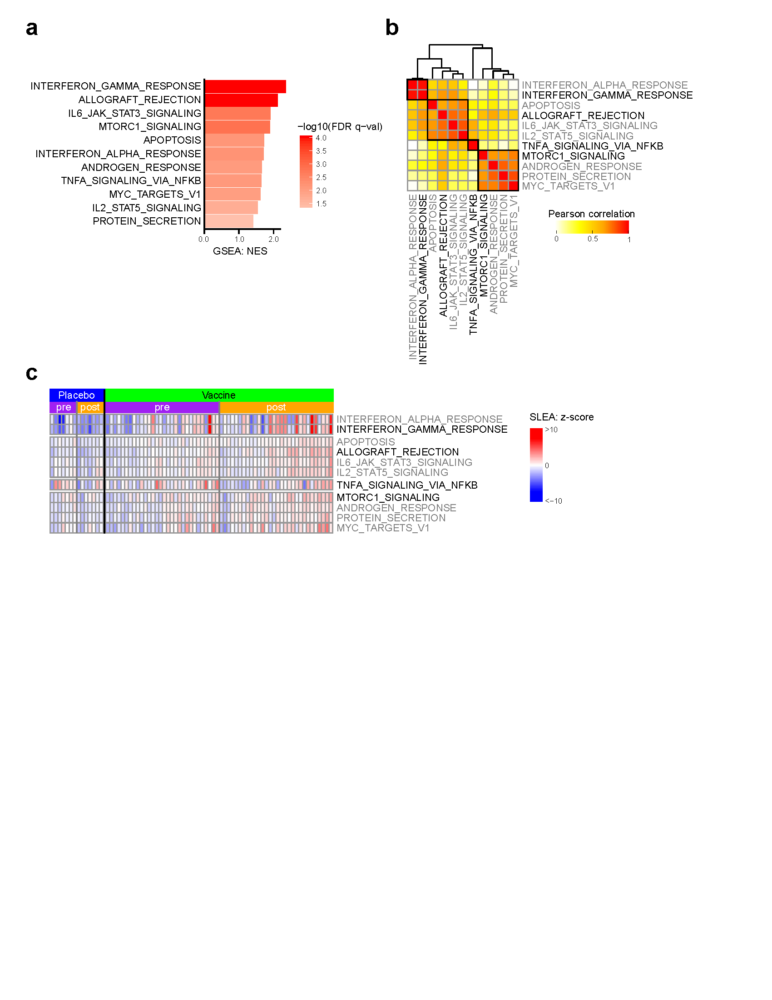

# RV144: source code #

## List of figures:
 
[Fig. 1](#markdown-header-fig-1), [Fig. 2](#markdown-header-fig-2)

## Fig. 1

## Fig. 2

### a. transcriptomic pilot study:
code:  
- R code: [[md]](code/20160509_RV144pilot.preprocessing.code.md)  

input:  
