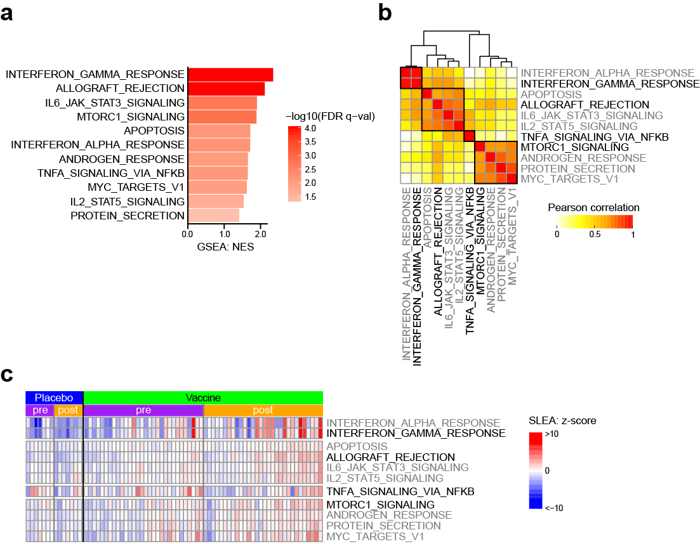
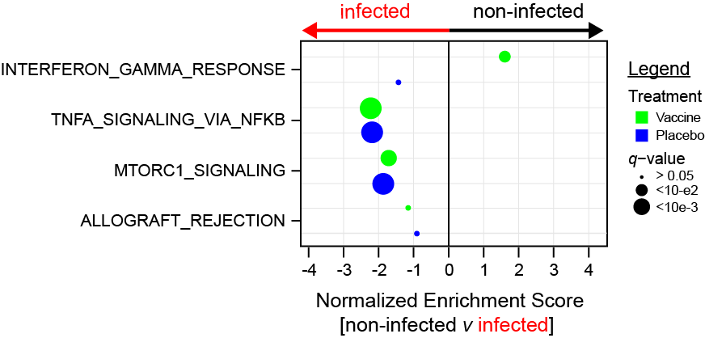
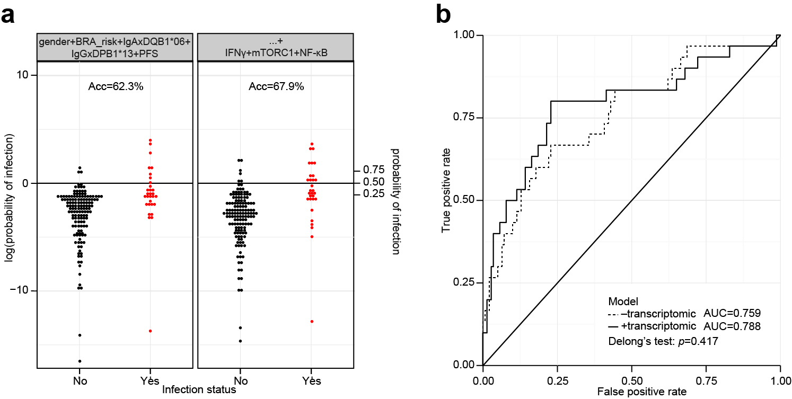
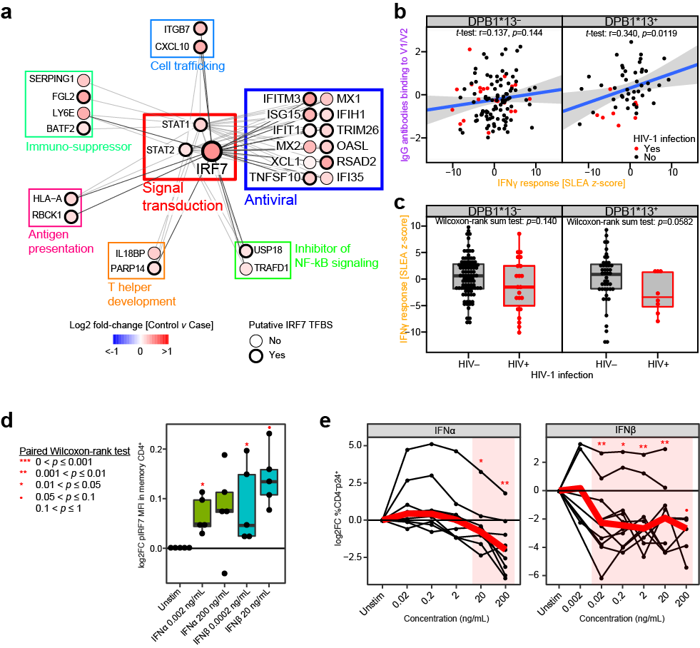
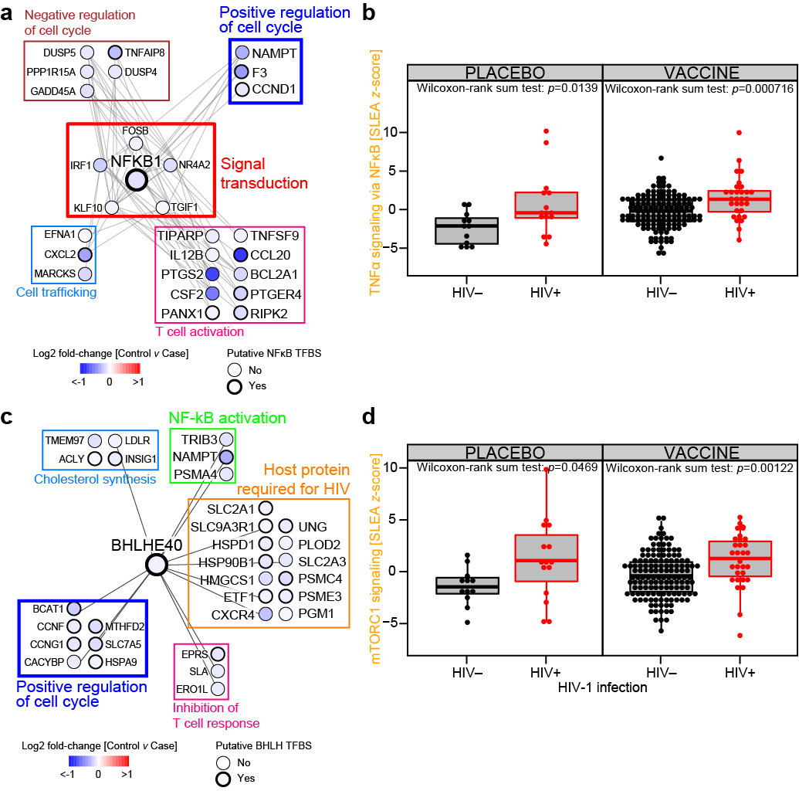

# RV144: source code #

## List of figures:
 
[Fig. 2](#fig-2), [Fig. 3](#fig-3), [Fig. 4](#fig-4), [Fig. 5](#fig-5), [Fig. 6](#fig-6)

### Fig. 2

Fig. 2: [R code [MD]](code/20160510_RV144pilot.Fig2.code.md), [Input file [RData]](output/rv144pilot.gsSetVehSubstracted.RData) 

### Fig. 3

Fig. 3: [R code [MD]](code/20160216_RV144.Fig3.code.md), [Input file [RData]](output/rv144.gseaOutput.RData) 

### Fig. 4

Fig. 4: [R code [MD]](code/20161216_RV144.Fig4.code.md)  
  
### Fig. 5

### Fig. 6

## Supplemental material:

### a. transcriptomic pilot study:
code:  
- preprocessing: [[MD]](code/20160509_RV144pilot.preprocessing.code.md)  
- geneset-analysis: [[MD]](code/20160510_RV144pilot.geneset_analysis.code.md)  

input:  
- non-normalized matrix: [[CSV]](see data release)
- arrays/samples annotation: [[CSV]](input/GA_illumina_expression.rv144pilot.metadata.csv)  
- features annotation: [[TSV]](input/Illumina_HumanHT12_V4.hg19.chip)  
  
output:  
- non-normalized ExpressionSet: [[RDA]](output/rv144pilot.esetRaw.RData)  
- quantile normalized ExpressionSet: [[RDA]](output/rv144pilot.eset.RData)  
- DMSO-substracted ExpressionSet: [[RDA]](output/rv144pilot.esetVehSubstract.RData)  
- pre-vaccination-substracted ExpressionSet: [[RDA]](output/rv144pilot.esetBaselined.RData)  
- MArrayLM list: [[RDA]](output/rv144pilot.fits.RData)  
- gsea result table: [[RDA]](output/rv144pilot.gseaOutput.RData)  
- slea ExpressionSet: [[RDA]](output/rv144pilot.gsSetVehSubstracted.RData)  

### b. transcriptomic case/control study:
code:  
- preprocessing: [[MD]](code/20151007_RV144.preprocessing.code.md)  
- geneset analysis: [[MD]](code/20151007_RV144.geneset_analysis.code.md)  
- integrative analysis: [[MD]](code/20151020_RV144.integrative_analysis.code.md)  

input:  
- non-normalized matrix: [[CSV]](see data release)
- arrays/samples annotation: [[CSV]](input/GA_illumina_expression.rv144.metadata.csv)  
- features annotation: [[TSV]](input/Illumina_HumanHT12_V4.hg19.chip)  
- antibody and cellular data: [[CSV]](input/rv144.primary_correlates_scaled_wk26.csv)  
- flow cytometry data: counts [[CSV]](input/rv144.phenotype_counts.csv), population annotation [[CSV]](input/rv144.phenotype_features_annotation.csv), sample annotation [[CSV]](input/rv144.phenotype_samples_annotation.csv)  
- luminex data: [[CSV]](input/rv144.luminex.csv)  
- ics data: [[CSV]](input/rv144.compass_ics_scaled.csv)  
- haplotype data: [[CSV]](input/rv144.haplotype.csv)  

output:  
- non-normalized ExpressionSet: [[RDA]](output/rv144.esetRaw.RData)  
- quantile normalized ExpressionSet: [[RDA]](output/rv144.eset.RData)  
- DMSO-substracted ExpressionSet: [[RDA]](output/rv144.esetBaselined.RData)  
- MArrayLM list: [[RDA]](output/rv144.fits.RData)  
- gsea result table: [[RDA]](output/rv144.gseaOutput.RData)  
- slea ExpressionSet: [[RDA]](output/rv144.gsSet.RData)  
- antibody and cellular ExpressionSet: [[RDA]](output/rv144.primCorrelatesSet.RData)  
- flow cytometry ExpressionSet: raw [[RDA]](output/rv144.phenotypeRawSet.RData), normalized [[RDA]](output/rv144.phenotypeSet.RData)  
- luminex ExpressionSet: [[RDA]](output/rv144.luminexSet.RData)  
- ics ExpressionSet: [[RDA]](output/rv144.icsSet.RData)  
- haplotype ExpressionSet: [[RDA]](output/rv144.haplotypeSet.RData)  

