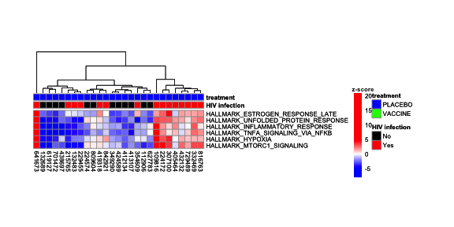
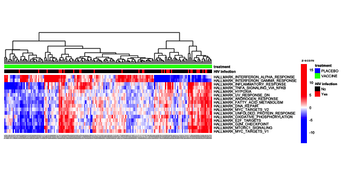

loading require packages

```r
suppressPackageStartupMessages(library(package = "RCurl"))
suppressPackageStartupMessages(library(package = "Biobase"))
suppressPackageStartupMessages(library(package = "limma"))
suppressPackageStartupMessages(library(package = "knitr"))
suppressPackageStartupMessages(library(package = "readr"))
suppressPackageStartupMessages(library(package = "parallel"))
suppressPackageStartupMessages(library(package = "pheatmap"))
suppressPackageStartupMessages(library(package = "gtable"))
suppressPackageStartupMessages(library(package = "grid"))
suppressPackageStartupMessages(library(package = "dplyr"))
suppressPackageStartupMessages(library(package = "tidyr"))
suppressPackageStartupMessages(library(package = "tibble"))
```

set default options/variables

```r
workDir <- dirname(getwd())
opts_chunk$set(tidy = FALSE, fig.path = "../figure/")
options(stringsAsFactors  = FALSE,
        width             = 80,
        mc.cores          = detectCores() - 1,
        readr.num_columns = 0)
# result will be written in directory called advanced
gseaDir <- file.path(workDir, "advanced")
if (!file.exists(gseaDir)) {
  flag <- dir.create(path = gseaDir)
}
```

read ENV-DMSO ExpressionSet

```r
esetBaselinedFile <- file.path(workDir, "output/rv144.esetBaselined.RData")
load(file = esetBaselinedFile)
```

read MArrayLM list

```r
fitsFile <- file.path(workDir, "output/rv144.fits.RData")
load(file = fitsFile)
```

download GSEA JAR file and hallmark GMT

```r
# download GSEA JAR application from the BROAD web site
gseaJar <- file.path(workDir, "utils/gsea2-2.2.1.jar")
# downaload hallmark in GMT file from the MSigDB web site
gmtFile <- file.path(workDir, "utils/h.all.v5.1.symbols.gmt")
```

create ranked list file

```r
# extract MArrayLM object for the comparison HIV infected versus non-infected
modelName <- "infection"
fit2 <- fits[[modelName]][["fit2"]]
# gene will be sorted by LIMMA moderated t-statistic
sortBy <- "t"
# for each coefficient of the MArrayLM create a ranked list file (RNK)
rnkList <- lapply(colnames(fit2), FUN = function(coefficient) {
  top <- topTable(fit      = fit2,
                  coef     = coefficient,
                  number   = Inf,
                  genelist = fit2$genes[, c("IlmnID", "SYMBOL"), drop = FALSE],
                  sort.by  = sortBy)
  # split ambiguous mapping (probe annotated to multiple genes)
  geneLS <- strsplit(top$SYMBOL, split = " /// ")
  names(geneLS) <- 1:length(geneLS)
  geneMap <- stack(geneLS)
  geneMap$ind <- as.numeric(as.vector(geneMap$ind))
  top <- top[geneMap$ind, ]
  top$SYMBOL <- geneMap$values
  # select the probe with the largest variance as representative of a gene
  top <- top[order(fit2$sigma[match(top$IlmnID, table = fit2$genes$IlmnID)],
                   decreasing = TRUE), ]
  uniqGeneList <- setdiff(top$SYMBOL, "---")
  top <- top[match(uniqGeneList, table = top$SYMBOL), ]
  top <- top[, c("SYMBOL", sortBy)]
  rnkFile <- paste0("gsea_", modelName, "_", coefficient, ".rnk") %>%
    make.names(.) %>%
    file.path(gseaDir, .)
  write(paste(c("#", colnames(top)), collapse = " "), file = rnkFile)
  write_tsv(top, path = rnkFile, append = TRUE)
  return(value = c(modelName   = modelName,
                   coefficient = coefficient,
                   rnk         = rnkFile))
})
rnkList <- do.call(what = rbind, args = rnkList)
```

create GSEA parameters file

```r
gseaParam <- file.path(gseaDir, "GSEAPrerankedParameters.txt")
gseaParamMat <- as.matrix(c(collapse             = "false",
                            nperm                = "1000",
                            scoring_scheme       = "weighted",
                            include_only_symbols = "true",
                            make_sets            = "true",
                            plot_top_x           = 1,
                            rnd_seed             = 101,
                            set_max              = 500,
                            set_min              = 15,
                            zip_report           = "false",
                            gui                  = "false"),
                          ncol = 1) %>%
  as.data.frame() %>%
  rownames_to_column()
write_tsv(gseaParamMat, path = gseaParam, col_names = FALSE)
```

run preranked GSEA

```r
# generate GSEA command line call
gseaJava <- "java -Xmx2G -cp"
gseaIndex <- lapply(rnkList[, "rnk"], FUN = function(gseaRnk) {
  logFileName <- gsub(pattern = "rnk$", replacement = "log", gseaRnk)
  gseaRpt <- basename(c(gseaRnk, gmtFile))
  gseaRpt <- gsub(pattern = "[.].+$", replacement = "", gseaRpt)
  gseaRpt <- paste(gseaRpt, collapse = ".")
  gseaCall <- paste(gseaJava,
                    gseaJar,
                    "xtools.gsea.GseaPreranked -param_file",
                    gseaParam,
                    "-rnk",
                    gseaRnk,
                    "-gmx",
                    gmtFile,
                    "-rpt_label",
                    gseaRpt,
                    "-out",
                    gseaDir,
                    ">",
                    logFileName)
  gseaIntern <- system(command       = gseaCall,
                       intern        = TRUE,
                       ignore.stderr = TRUE)
  return(value = c(rnk = gseaRnk, rpt = file.path(gseaDir, gseaRpt)))
})
gseaIndex <- do.call(what = rbind, args = gseaIndex)
gseaIndex <- merge(rnkList, gseaIndex, by = "rnk")
```

remove previous gsea run from the advanced directory

```r
dirLS <- list.dirs(gseaDir, recursive = FALSE)
dirLS <- cbind(directory = dirLS,
               rpt       = gsub(pattern = ".GseaPreranked.+$",
                   replacement = "",
                   dirLS))
gseaIndex <- merge(gseaIndex, dirLS, by = "rpt")
```

read gsea output directories

```r
gseaOutput <- apply(gseaIndex, MARGIN = 1, FUN = function(gseaRun) {
  gseaDir <- gseaRun[["directory"]]
  # read rpt file in gsea output directory
  rptFile <- list.files(path = gseaDir, pattern = "rpt", full.names = TRUE)
  rpt <- read_tsv(file      = rptFile,
                  col_names = c("type", "name", "value"))
  # read gmt file
  gmxFile <- rpt$value[rpt$name %in% "gmx"]
  gmx <- read_tsv(file = gmxFile, col_names = FALSE)
  # remove geneset name and description column
  gsNames <- gmx$X1
  gmx <- apply(select(gmx, -(1:2)), MARGIN = 1, FUN = function(x) {
    return(value = setdiff(unname(x), NA))
  })
  names(gmx) <- gsNames
  # read result files
  resFile <- grep(pattern = "gsea_report.*xls",
                  dir(path = gseaDir, full.names = TRUE),
                  value   = TRUE)
  resOut <- lapply(resFile, FUN = function(fileName) {
    resTable <- read_tsv(file = fileName)
  })
  resOut <- do.call(what = rbind, args = resOut)
  # extract leading edge genes
  rnk <- read_tsv(file      = gseaRun[["rnk"]],
                  skip      = 1,
                  col_names = c("SYMBOL", "t")) %>%
         arrange(desc(t))
  leGenes <- group_by(resOut, NAME) %>%
             do(LEADING_EDGE = ifelse(test = sign(.$NES) %in% 1,
                    yes = paste(intersect(rnk$SYMBOL[seq(from = 1,
                                                         to = .$"RANK AT MAX" +
                                                           1)],
                                          gmx[[.$NAME]]), collapse = ","),
                    no  = paste(intersect(rnk$SYMBOL[seq(from = nrow(rnk) -
                                                           .$"RANK AT MAX",
                                                         to = nrow(rnk))],
                                          gmx[[.$NAME]]), collapse = ","))) %>%
    ungroup() %>%
    mutate(LEADING_EDGE = unlist(LEADING_EDGE))
  resOut <- merge(resOut, leGenes, by = "NAME")
  # append directory name
  resOut <- mutate(resOut, directory = gseaDir)
  return(value = resOut)
})
gseaOutput <- do.call(what = rbind, args = gseaOutput)
gseaOutput <- merge(gseaOutput, gseaIndex, by = "directory")
# save gseaOutput
save(gseaOutput, file = file.path(workDir, "output/rv144.gseaOutput.RData"))
```

delete temporary and advanced directories create during gsea run

```r
dirName <- tolower(format(Sys.Date(), "%b%d"))
file.remove(dirName)
```

```
## [1] TRUE
```

```r
# remove advanced directory
unlink(gseaDir, recursive = TRUE)
```

Print statistically significant enriched genesets for the 15h timepoint

```r
# print statistically significant enriched genesets for the placebo group
gseaOutput %>%
  filter(grepl(pattern = "PLACEBO", coefficient) & `FDR q-val` <= 0.05) %>%
  select(coefficient, NAME, NES, `FDR q-val`) %>%
  arrange(desc(sign(NES)), `FDR q-val`) %>%
  as.data.frame() %>%
  print()
```

```
##              coefficient                               NAME       NES
## 1 PLACEBO_No-PLACEBO_Yes                   HALLMARK_HYPOXIA -2.040240
## 2 PLACEBO_No-PLACEBO_Yes   HALLMARK_TNFA_SIGNALING_VIA_NFKB -2.167539
## 3 PLACEBO_No-PLACEBO_Yes HALLMARK_UNFOLDED_PROTEIN_RESPONSE -1.900919
## 4 PLACEBO_No-PLACEBO_Yes          HALLMARK_MTORC1_SIGNALING -1.850100
## 5 PLACEBO_No-PLACEBO_Yes     HALLMARK_INFLAMMATORY_RESPONSE -1.624006
## 6 PLACEBO_No-PLACEBO_Yes    HALLMARK_ESTROGEN_RESPONSE_LATE -1.526873
##      FDR q-val
## 1 0.0000000000
## 2 0.0000000000
## 3 0.0006212122
## 4 0.0008601399
## 5 0.0165918560
## 6 0.0440113880
```

```r
# print statistically significant enriched genesets for the vaccine group
gseaOutput %>%
  filter(grepl(pattern = "VACCINE", coefficient) & `FDR q-val` <= 0.05) %>%
  select(coefficient, NAME, NES, `FDR q-val`) %>%
  arrange(desc(sign(NES)), `FDR q-val`) %>%
  as.data.frame() %>%
  print()
```

```
##               coefficient                               NAME       NES
## 1  VACCINE_No-VACCINE_Yes HALLMARK_INTERFERON_ALPHA_RESPONSE  2.224985
## 2  VACCINE_No-VACCINE_Yes HALLMARK_INTERFERON_GAMMA_RESPONSE  1.611962
## 3  VACCINE_No-VACCINE_Yes            HALLMARK_MYC_TARGETS_V1 -2.103227
## 4  VACCINE_No-VACCINE_Yes   HALLMARK_TNFA_SIGNALING_VIA_NFKB -2.208247
## 5  VACCINE_No-VACCINE_Yes         HALLMARK_ANDROGEN_RESPONSE -1.860506
## 6  VACCINE_No-VACCINE_Yes               HALLMARK_E2F_TARGETS -1.680729
## 7  VACCINE_No-VACCINE_Yes          HALLMARK_MTORC1_SIGNALING -1.695250
## 8  VACCINE_No-VACCINE_Yes     HALLMARK_INFLAMMATORY_RESPONSE -1.613153
## 9  VACCINE_No-VACCINE_Yes HALLMARK_OXIDATIVE_PHOSPHORYLATION -1.564661
## 10 VACCINE_No-VACCINE_Yes            HALLMARK_MYC_TARGETS_V2 -1.545885
## 11 VACCINE_No-VACCINE_Yes            HALLMARK_UV_RESPONSE_DN -1.495664
## 12 VACCINE_No-VACCINE_Yes HALLMARK_UNFOLDED_PROTEIN_RESPONSE -1.448732
## 13 VACCINE_No-VACCINE_Yes                HALLMARK_DNA_REPAIR -1.451239
## 14 VACCINE_No-VACCINE_Yes     HALLMARK_FATTY_ACID_METABOLISM -1.461613
## 15 VACCINE_No-VACCINE_Yes            HALLMARK_G2M_CHECKPOINT -1.427218
## 16 VACCINE_No-VACCINE_Yes                   HALLMARK_HYPOXIA -1.408479
##       FDR q-val
## 1  0.0000000000
## 2  0.0280913060
## 3  0.0000000000
## 4  0.0000000000
## 5  0.0009074074
## 6  0.0074106874
## 7  0.0089333600
## 8  0.0134427980
## 9  0.0206919460
## 10 0.0221957960
## 11 0.0340970680
## 12 0.0374252950
## 13 0.0403314120
## 14 0.0414474530
## 15 0.0426526960
## 16 0.0488512100
```

perform sample-level enrichment analysis

```r
# transform gene by sample expression to geneset by sample expression
# where geneset expression is the z-score calculated as described in
# Lopez-Bigas N. et al. (2008) Genome Biol. 9(2):R33. PMID: 18279504.

# step 1: transform probe by sample expression to gene by sample expression
# select the probe with the largest variance as representative of a gene
exprsMat <- exprs(esetBaselined)
exprsMat <- exprsMat[order(apply(exprsMat, MARGIN = 1, FUN = var),
                           decreasing = TRUE), ]
# split ambiguous mapping (probe annotated to multiplce genes)
geneLS <- strsplit(fData(esetBaselined)[rownames(exprsMat), "SYMBOL"],
                   split = " /// ")
names(geneLS) <- 1:length(geneLS)
geneMap <- stack(geneLS)
geneMap$ind <- as.numeric(as.vector(geneMap$ind))
uniqGeneList <- setdiff(geneMap$values, "---")
geneMap <- geneMap[match(uniqGeneList, table = geneMap$values), ]
exprsMat <- exprsMat[geneMap$ind, ]
rownames(exprsMat) <- geneMap$values
exprsMat <- t(scale(t(exprsMat)))

# step 2: for every genesets calculate average expression of leading edge genes
#  and compared it to the average expression of a set of genes of same size.
gseaOutputVax <- filter(gseaOutput, grepl("VACCINE", coefficient))
leGenes <- strsplit(gseaOutputVax$LEADING_EDGE, split = ",")
names(leGenes) <- gseaOutputVax$NAME
# number of sample permutation
B <- 1000
zscoreVaxMat <- sapply(leGenes, FUN = function(gs) {
  ngenes <- length(gs)
  mu <- colMeans(exprsMat[gs, esetBaselined$treatment %in% "VACCINE"])
  muPermut <- mclapply(1:B, FUN = function(seed) {
    set.seed(seed = seed)
    muHat <- colMeans(exprsMat[sample.int(nrow(exprsMat), ngenes),
                               esetBaselined$treatment %in% "VACCINE"])
    return(value = muHat)
  })
  muPermut <- do.call(what = rbind, args = muPermut)
  zscore <- (mu - colMeans(muPermut)) / apply(muPermut, MARGIN = 2, FUN = sd)
  return(value = zscore)
})
# same for placebo samples
gseaOutputPlacebo <- filter(gseaOutput, grepl("PLACEBO", coefficient))
leGenes <- strsplit(gseaOutputPlacebo$LEADING_EDGE, split = ",")
names(leGenes) <- gseaOutputPlacebo$NAME
zscorePlaceboMat <- sapply(leGenes, FUN = function(gs) {
  ngenes <- length(gs)
  mu <- colMeans(exprsMat[gs, esetBaselined$treatment %in% "PLACEBO"])
  muPermut <- mclapply(1:B, FUN = function(seed) {
    set.seed(seed = seed)
    muHat <- colMeans(exprsMat[sample.int(nrow(exprsMat), ngenes),
                               esetBaselined$treatment %in% "PLACEBO"])
    return(value = muHat)
  })
  muPermut <- do.call(what = rbind, args = muPermut)
  zscore <- (mu - colMeans(muPermut)) / apply(muPermut, MARGIN = 2, FUN = sd)
  return(value = zscore)
})
zscoreMat <- cbind(t(zscoreVaxMat[, names(leGenes)]),
                   t(zscorePlaceboMat[, names(leGenes)]))
zscoreMat <- zscoreMat[, sampleNames(esetBaselined)]

# step 3: create ExpressionSet with genesets by sample expression
featuresAnnotation <- gseaOutput %>%
  select(modelName, coefficient,
         NAME, SIZE, NES, `FDR q-val`, `RANK AT MAX`, LEADING_EDGE) %>%
  mutate(coefficient = ifelse(test = grepl(pattern = "PLACEBO", coefficient),
             yes = "PLACEBO",
             no = "VACCINE")) %>%
  gather(key, value, -coefficient, -NAME, -SIZE) %>%
  mutate(key = paste(coefficient, key, sep = ".")) %>%
  select(-coefficient) %>%
  spread(key, value)
rownames(featuresAnnotation) <- featuresAnnotation$NAME
gsSet <- ExpressionSet(assayData   = zscoreMat,
                       phenoData   = AnnotatedDataFrame(pData(esetBaselined)),
                       featureData = AnnotatedDataFrame(featuresAnnotation))
# print geneset ExpressionSet
print(gsSet)
```

```
## ExpressionSet (storageMode: lockedEnvironment)
## assayData: 50 features, 199 samples 
##   element names: exprs 
## protocolData: none
## phenoData
##   sampleNames: RV144_d107034_92TH023ENV RV144_d109816_92TH023ENV ...
##     RV144_d852086_92TH023ENV (199 total)
##   varLabels: Sample name idat file ... HIV infection (10 total)
##   varMetadata: labelDescription
## featureData
##   featureNames: HALLMARK_ADIPOGENESIS HALLMARK_ALLOGRAFT_REJECTION ...
##     HALLMARK_XENOBIOTIC_METABOLISM (50 total)
##   fvarLabels: NAME SIZE ... VACCINE.RANK AT MAX (12 total)
##   fvarMetadata: labelDescription
## experimentData: use 'experimentData(object)'
## Annotation:
```

```r
# save geneset ExpressionSet
save(gsSet, file = file.path(workDir, "output/rv144.gsSet.RData"))

# step 4: create ExpressionSet with sample-level enrichement analysis z-scores
# based on all the gene in the geneset (not just leading edge genes)
# read gmt file
gmx <- read_tsv(file = gmtFile, col_names = FALSE)
# remove geneset name and description column
gsNames <- gmx$X1
gmx <- apply(select(gmx, -(1:2)), MARGIN = 1, FUN = function(x) {
    return(value = setdiff(unname(x), NA))
  })
names(gmx) <- gsNames

B <- 1000 # number of sample permutation
zscoreMat <- sapply(gmx, FUN = function(gs) {
    gs <- intersect(gs, rownames(exprsMat))
      ngenes <- length(gs)
      mu <- colMeans(exprsMat[gs, ])
      muPermut <- mclapply(1:B, FUN = function(seed) {
            set.seed(seed = seed)
                muHat <- colMeans(exprsMat[sample.int(nrow(exprsMat), ngenes), ])
                return(value = muHat)
          })
      muPermut <- do.call(what = rbind, args = muPermut)
      zscore <- (mu - colMeans(muPermut)) / apply(muPermut, MARGIN = 2, FUN = sd)
      return(value = zscore)
  })
zscoreMat <- t(zscoreMat[, names(gmx)])
featuresAnnotation <- featuresAnnotation[rownames(zscoreMat), ]
gsSetRaw <- ExpressionSet(assayData   = zscoreMat,
                       phenoData   = AnnotatedDataFrame(pData(esetBaselined)),
                       featureData = AnnotatedDataFrame(featuresAnnotation))
# print geneset ExpressionSet
print(gsSetRaw)
```

```
## ExpressionSet (storageMode: lockedEnvironment)
## assayData: 50 features, 199 samples 
##   element names: exprs 
## protocolData: none
## phenoData
##   sampleNames: RV144_d107034_92TH023ENV RV144_d109816_92TH023ENV ...
##     RV144_d852086_92TH023ENV (199 total)
##   varLabels: Sample name idat file ... HIV infection (10 total)
##   varMetadata: labelDescription
## featureData
##   featureNames: HALLMARK_TNFA_SIGNALING_VIA_NFKB HALLMARK_HYPOXIA ...
##     HALLMARK_PANCREAS_BETA_CELLS (50 total)
##   fvarLabels: NAME SIZE ... VACCINE.RANK AT MAX (12 total)
##   fvarMetadata: labelDescription
## experimentData: use 'experimentData(object)'
## Annotation:
```

```r
# save geneset ExpressionSet
save(gsSetRaw, file = file.path(workDir, "output/rv144.gsSetRaw.RData"))
```

heatmaps for significantly enriched genesets in the placebo group

```r
bluered <- colorRampPalette(colors = c("blue", "white", "red"))
esetTemp <- gsSet[fData(gsSet)$"PLACEBO.FDR q-val" <= 0.05,
                  gsSet$treatment %in% "PLACEBO"]
gsHeat <- pheatmap(mat              = exprs(esetTemp),
                   color            = bluered(100),
                   breaks           = c(min(exprs(esetTemp)),
                       seq(from = -5, to = 5, length.out = 99),
                       max(exprs(esetTemp))),
                   cellwidth        = 8,
                   cellheight       = 8,
                   fontsize         = 8,
                   treeheight_row   = 0,
                   annotation_col   = pData(esetTemp)[,
                       c("HIV infection", "treatment")],
                   annotation_color =
                   list("HIV infection" = c(No = "black", Yes = "red"),
                        treatment       = c(PLACEBO = "blue",
                                            VACCINE = "green")),
                   labels_col        = esetTemp$donor)
colorName <- textGrob(label = "z-score",
                      x     = 0.5,
                      y     = 1.05,
                      gp    = gpar(fontface = "bold"))
gsHeat$gtable <- gtable_add_grob(gsHeat$gtable,
                                 colorName,
                                 t    = 3,
                                 l    = 5,
                                 b    = 5,
                                 clip = "off",
                                 name = "colorName")
grid.draw(gsHeat$gtable)
```



heatmaps for significantly enriched genesets in the vaccine group

```r
esetTemp <- gsSet[fData(gsSet)$"VACCINE.FDR q-val" <= 0.05,
                  gsSet$treatment %in% "VACCINE"]
gsHeat <- pheatmap(mat              = exprs(esetTemp),
                   color            = bluered(100),
                   breaks           = c(min(exprs(esetTemp)),
                       seq(from = -5, to = 5, length.out = 99),
                       max(exprs(esetTemp))),
                   cellwidth        = 2,
                   cellheight       = 6,
                   fontsize         = 6,
                   fontsize_col     = 2,
                   treeheight_row   = 0,
                   annotation_col   = pData(esetTemp)[,
                       c("HIV infection", "treatment")],
                   annotation_color =
                   list("HIV infection" = c(No = "black", Yes = "red"),
                        treatment       = c(PLACEBO = "blue",
                                            VACCINE = "green")),
                   labels_col        = esetTemp$donor)
colorName <- textGrob(label = "z-score",
                      x     = 0.5,
                      y     = 1.05,
                      gp    = gpar(fontface = "bold"))
gsHeat$gtable <- gtable_add_grob(gsHeat$gtable,
                                 colorName,
                                 t    = 3,
                                 l    = 5,
                                 b    = 5,
                                 clip = "off",
                                 name = "colorName")
grid.draw(gsHeat$gtable)
```



print session info

```r
sessionInfo()
```

```
## R version 3.5.1 (2018-07-02)
## Platform: x86_64-apple-darwin17.6.0 (64-bit)
## Running under: macOS High Sierra 10.13.6
## 
## Matrix products: default
## BLAS: /System/Library/Frameworks/Accelerate.framework/Versions/A/Frameworks/vecLib.framework/Versions/A/libBLAS.dylib
## LAPACK: /System/Library/Frameworks/Accelerate.framework/Versions/A/Frameworks/vecLib.framework/Versions/A/libLAPACK.dylib
## 
## locale:
## [1] en_US.UTF-8/en_US.UTF-8/en_US.UTF-8/C/en_US.UTF-8/en_US.UTF-8
## 
## attached base packages:
## [1] grid      parallel  stats     graphics  grDevices utils     datasets 
## [8] methods   base     
## 
## other attached packages:
##  [1] bindrcpp_0.2.2      tibble_1.4.2        tidyr_0.8.1        
##  [4] dplyr_0.7.6         gtable_0.2.0        pheatmap_1.0.10    
##  [7] readr_1.1.1         knitr_1.20          limma_3.36.3       
## [10] Biobase_2.40.0      BiocGenerics_0.26.0 RCurl_1.95-4.11    
## [13] bitops_1.0-6       
## 
## loaded via a namespace (and not attached):
##  [1] Rcpp_0.12.18       highr_0.7          pillar_1.3.0       compiler_3.5.1    
##  [5] RColorBrewer_1.1-2 bindr_0.1.1        tools_3.5.1        evaluate_0.11     
##  [9] pkgconfig_2.0.2    rlang_0.2.2        cli_1.0.0          stringr_1.3.1     
## [13] hms_0.4.2          tidyselect_0.2.4   glue_1.3.0         R6_2.2.2          
## [17] fansi_0.3.0        purrr_0.2.5        magrittr_1.5       scales_1.0.0      
## [21] assertthat_0.2.0   colorspace_1.3-2   utf8_1.1.4         stringi_1.2.4     
## [25] munsell_0.5.0      crayon_1.3.4
```

