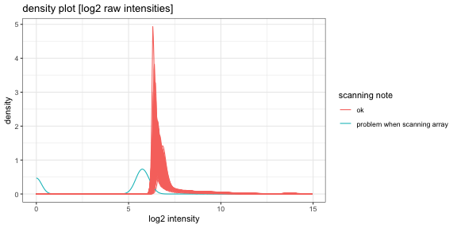
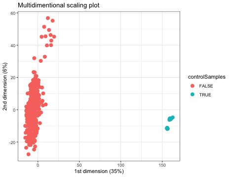
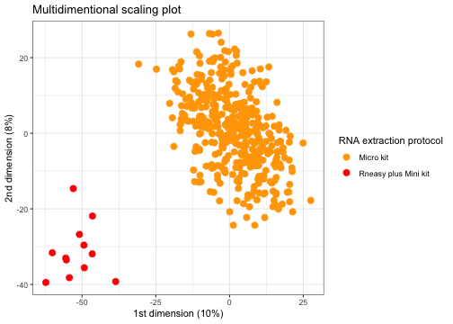
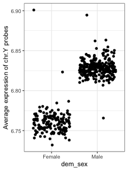
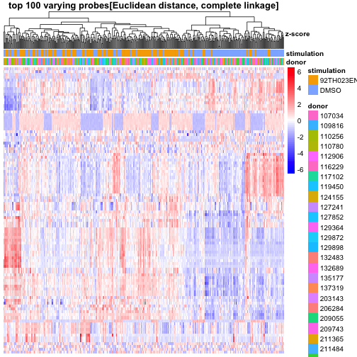
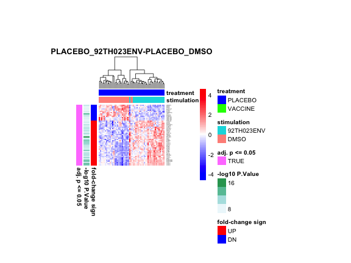
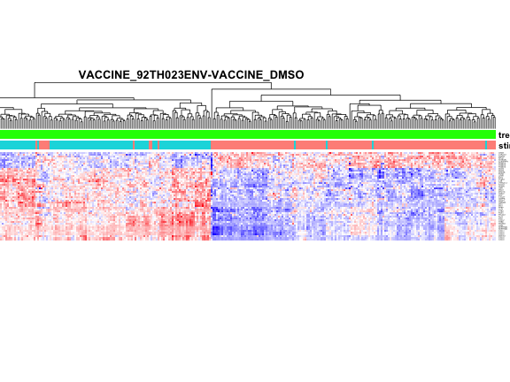
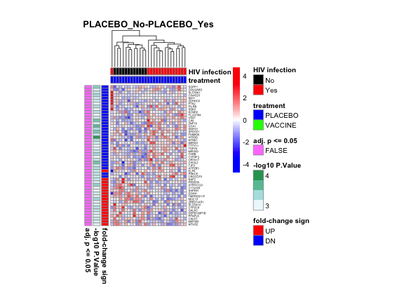
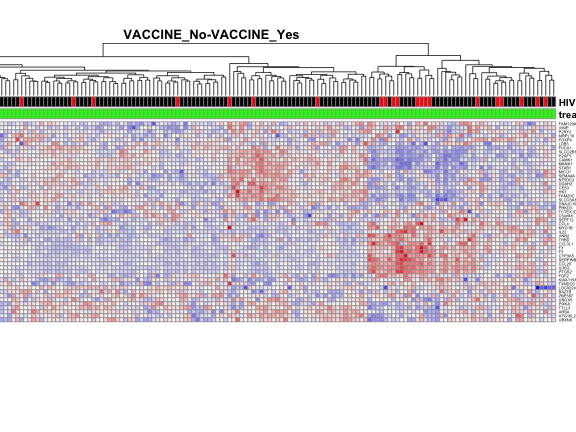

loading require packages

```r
suppressPackageStartupMessages(library(package = "readr"))
suppressPackageStartupMessages(library(package = "Biobase"))
suppressPackageStartupMessages(library(package = "impute"))
suppressPackageStartupMessages(library(package = "org.Hs.eg.db"))
suppressPackageStartupMessages(library(package = "ggplot2"))
suppressPackageStartupMessages(library(package = "limma"))
suppressPackageStartupMessages(library(package = "knitr"))
suppressPackageStartupMessages(library(package = "pheatmap"))
suppressPackageStartupMessages(library(package = "grid"))
suppressPackageStartupMessages(library(package = "gtable"))
suppressPackageStartupMessages(library(package = "RCurl"))
suppressPackageStartupMessages(library(package = "dplyr"))
suppressPackageStartupMessages(library(package = "tidyr"))
suppressPackageStartupMessages(library(package = "tibble"))
```

set default options/variables

```r
workDir <- dirname(getwd())
opts_chunk$set(tidy = FALSE, fig.path = "../figure/")
options(stringsAsFactors  = FALSE,
        width             = 80,
        mc.cores          = detectCores() - 1,
        readr.num_columns = 0)
```

read non-normalized matrix

```r
rawFile <- file.path(workDir,
                     "input/GA_illumina_expression.rv144.matrix_non_norm.csv")
rawMat <- read_csv(file = rawFile, progress = FALSE)
```

read arrays annotation

```r
arraysAnnotFile <- file.path(workDir,
                             "input",
                             "GA_illumina_expression.rv144.metadata.csv")
arraysAnnotation <- read_csv(file = arraysAnnotFile, progress = FALSE)
# remove unused phenotypic information
arraysAnnotation <- select(arraysAnnotation,
                           -title,
                           -`source name`,
                           -organism,
                           -molecule,
                           -label,
                           -description,
                           -platform)
# remove prefix 'characteristics` of column names
names(arraysAnnotation) <- gsub(pattern = "^[^:]+: (.+)$",
                                replacement = "\\1",
                                names(arraysAnnotation))
```

read features annotation

```r
featuresAnnotFile <- file.path(workDir, 
                               "input/Illumina_HumanHT12_V4.hg19.chip")
featuresAnnotation <- read_tsv(file = featuresAnnotFile, progress = FALSE) %>%
    as.data.frame()
rownames(featuresAnnotation) <- featuresAnnotation$IlmnID
```

read clinical annotation

```r
clinicalAnnotFile <- file.path(workDir,
                               "input/rv144.master_wk26.csv")
clinicalAnnotation <- read_csv(file      = clinicalAnnotFile,
                               col_types = paste(rep("c", times = 21),
                                                 collapse = ""))
clinicalAnnotation <- lapply(clinicalAnnotation,
                             FUN   = type.convert,
                             as.is = TRUE) %>%
                      data.frame(check.names = FALSE)
# remove unused columns
clinicalAnnotation <- clinicalAnnotation %>%
  select(-v7, -v9)
rownames(clinicalAnnotation) <- clinicalAnnotation$pin
```

create non-normalized ExpressionSet

```r
# format raw matrix
rNames <- rawMat$"ID_REF"
rawMat <- rawMat[, -grep(pattern = "ID_REF|Detection Pval",
                         colnames(rawMat))]
rawMat <- as.matrix(rawMat)
rownames(rawMat) <- rNames
# format phenodata
arraysAnnotation <- as.data.frame(arraysAnnotation)
rownames(arraysAnnotation) <- arraysAnnotation$"Sample name"
arraysAnnotation <- arraysAnnotation[colnames(rawMat), ]
# format feature annotation
featuresAnnotation <- as.data.frame(featuresAnnotation)
featuresAnnotation <- featuresAnnotation[rownames(rawMat), ]
# create ExpressionSet
esetRaw <- ExpressionSet(assayData   = rawMat,
                         phenoData   = AnnotatedDataFrame(arraysAnnotation),
                         featureData = AnnotatedDataFrame(featuresAnnotation))
# save raw ExpressionSet
save(esetRaw, file = file.path(workDir, "output/rv144.esetRaw.RData"))
```

quality control: kernel densities plot

```r
intensities <- as.vector(exprs(esetRaw))
# log2 transform (replace intensities < 1 by 1 to prevent -Inf)
intensities <- log2(pmax(intensities, 1))
arrays <- rep(sampleNames(esetRaw), each = nrow(esetRaw))
scanNote <- rep(esetRaw$"scanning note",
                each = nrow(esetRaw))
plotDF <- data.frame(intensities, arrays, scanNote)
plotDens <- ggplot(data    = plotDF,
                   mapping = aes(x     = intensities,
                                 group = factor(arrays),
                                 color = scanNote)) +
            scale_color_discrete(name = "scanning note") +
            stat_density(geom = "path", position = "identity") +
            labs(x     = "log2 intensity",
                 title = "density plot [log2 raw intensities]") +
            theme_bw() +
            theme(legend.key = element_blank())
print(plotDens)
```



```r
# print problematic array name
outlierArrays <- filter(pData(esetRaw),
                        `scanning note` != "ok") %>%
                 .$"Sample name"
print(outlierArrays)
```

```
## [1] "RV144_d305968_DMSO"
```

```r
# exclude arrays from raw ExpressionSet
esetRaw <- esetRaw[, setdiff(sampleNames(esetRaw), outlierArrays)]
```

quality control: multidimentional scaling plot

```r
# create tempory ExpressionSet and normalize the data
esetTemp <- esetRaw
# exclude problematic arrays
esetTemp <- esetTemp[, setdiff(sampleNames(esetTemp), outlierArrays)]
rawMat <- exprs(esetTemp)
normMat <- normalizeBetweenArrays(rawMat, method = "quantile")
normMat <- log2(normMat)
# generate a multidimensional scaling plot
distMat <- dist(t(normMat))
mds <- cmdscale(d = distMat, k = ncol(normMat) - 1, eig = TRUE)
mdsStDev <- apply(mds$points, MARGIN = 2, FUN = sd)
mdsPercVar <- round((mdsStDev^2)/sum(mdsStDev^2) * 100)
plotDF <- data.frame(V1 = mds$points[, 1],
                     V2 = mds$points[, 2])
# color dots by whether a sample is a hybridization control
plotDF$controlSamples <- grepl(pattern = "control",
                               rownames(plotDF))
qcMdS <- ggplot(data = plotDF,
                mapping = aes(x = V1, y = V2, color = controlSamples)) +
         geom_point(size = 3) +
         labs(x     = paste0("1st dimension (", mdsPercVar[1], "%)"),
              y     = paste0("2nd dimension (", mdsPercVar[2], "%)"),
              title = "Multidimentional scaling plot") +
         theme_bw() +
         theme(legend.key = element_blank())
print(qcMdS)
```



```r
# print control array names
controlArrays <- filter(pData(esetRaw),
                        grepl(pattern = "control", `Sample name`)) %>%
                 .$"Sample name"
print(controlArrays)
```

```
##  [1] "RV144_control"       "RV144_control_rep12" "RV144_control_rep8" 
##  [4] "RV144_control_rep11" "RV144_control_rep1"  "RV144_control_rep6" 
##  [7] "RV144_control_rep7"  "RV144_control_rep2"  "RV144_control_rep10"
## [10] "RV144_control_rep14" "RV144_control_rep13" "RV144_control_rep9" 
## [13] "RV144_control_rep5"  "RV144_control_rep4"  "RV144_control_rep3"
```

quality control: multidimentional scaling plot excluding hybridization controls

```r
# create tempory ExpressionSet and normalize the data
esetTemp <- esetRaw
# exclude problematic arrays
esetTemp <- esetTemp[, setdiff(sampleNames(esetTemp),
                               c(outlierArrays, controlArrays))]
rawMat <- exprs(esetTemp)
normMat <- normalizeBetweenArrays(rawMat, method = "quantile")
normMat <- log2(normMat)
# generate a multidimensional scaling plot
distMat <- dist(t(normMat))
mds <- cmdscale(d = distMat, k = ncol(normMat) - 1, eig = TRUE)
mdsStDev <- apply(mds$points, MARGIN = 2, FUN = sd)
mdsPercVar <- round((mdsStDev^2)/sum(mdsStDev^2) * 100)
plotDF <- data.frame(V1 = mds$points[, 1],
                     V2 = mds$points[, 2])
# color dots by protocol used for RNA extraction
plotDF$RNAextractionProtocol <-
  pData(esetTemp)[rownames(plotDF), "RNA extraction protocol"]
qcMdS <- ggplot(data = plotDF,
                mapping = aes(x = V1, y = V2, color = RNAextractionProtocol)) +
         geom_point(size = 3) +
         scale_color_manual(name   =
                            "RNA extraction protocol",
                            values = c("orange", "red")) +
         labs(x     = paste0("1st dimension (", mdsPercVar[1], "%)"),
              y     = paste0("2nd dimension (", mdsPercVar[2], "%)"),
              title = "Multidimentional scaling plot") +
         theme_bw() +
         theme(legend.key = element_blank())
print(qcMdS)
```



```r
# print control array generated with different RNA extraction protocol
rnaExtractionArrays <- filter(pData(esetRaw),
                              grepl(
                                  pattern = "Rneasy",
                                  `RNA extraction protocol`)) %>%
                       .$"Sample name"
print(rnaExtractionArrays)
```

```
##  [1] "RV144_d825482_92TH023ENV" "RV144_d824374_92TH023ENV"
##  [3] "RV144_d849655_92TH023ENV" "RV144_d723863_92TH023ENV"
##  [5] "RV144_d203143_92TH023ENV" "RV144_d827158_92TH023ENV"
##  [7] "RV144_d736104_92TH023ENV" "RV144_d603208_92TH023ENV"
##  [9] "RV144_d627156_92TH023ENV" "RV144_d431442_92TH023ENV"
## [11] "RV144_d127852_92TH023ENV" "RV144_d513999_92TH023ENV"
```

normalizing raw expression

```r
eset <- esetRaw
# order esetRaw by idat file name and features by ProbeID
eset <- eset[order(as.numeric(fData(eset)$ProbeID)),
             order(eset$"idat file")]
# impute missing intensities (intensities = 0)
rawMat <- exprs(eset)
rawMat[rawMat == 0] <- NA
suppressWarnings(capture.output(rawMat <- impute.knn(data = rawMat)$data,
                                file = "/dev/null"))
exprs(eset) <- rawMat
# remove outlier
outlierArrays <- sampleNames(eset)[eset$outlierFlag != ""]
eset <- eset[, setdiff(sampleNames(eset),
                       c(outlierArrays, controlArrays, rnaExtractionArrays))]
# quantile normalized and log2 transform expression
normMat <- normalizeBetweenArrays(exprs(eset), method = "quantile")
# surrogate remplacement
normMat[normMat < 2^0.1] <- 2^0.1
normMat <- log2(normMat)
exprs(eset) <- normMat
# save normalized ExpressionSet
save(eset, file = file.path(workDir, "output/rv144.eset.RData"))
```

quality control: gender check

```r
symbol2chr <- merge(as.data.frame(org.Hs.egSYMBOL),
                    as.data.frame(org.Hs.egCHR),
                    by = "gene_id")
pb2symbol <- strsplit(fData(eset)$SYMBOL, split = " /// ") %>%
  setNames(fData(eset)$IlmnID) %>%
  stack() %>%
  mutate(ind = as.vector(ind))
pb2chr <- merge(symbol2chr, pb2symbol, by.x = "symbol", by.y = "values")

pbY <- filter(pb2chr, chromosome %in% "Y") %>%
  .$ind

plotDF <- data.frame(mu = colMeans(exprs(eset)[pbY, ])) %>%
  rownames_to_column() %>%
  merge(pData(eset), by.x = "rowname", by.y = "Sample name") %>%
  merge(clinicalAnnotation, by.x = "donor", by.y = "pin")
ggplot(data = plotDF, mapping = aes(x = dem_sex, y = mu)) +
  geom_jitter() +
  labs(y = "Average expression of chr.Y probes") +
  theme_bw()
```



exploratory analysis: heatmap based on top 100 most varying transcripts

```r
bluered <- colorRampPalette(colors = c("blue", "white", "red"))
varList <- apply(exprs(eset), MARGIN = 1, FUN = var)
esetTemp <- eset[order(varList, decreasing = TRUE)[1:100], ]
esetTemp$donor <- factor(esetTemp$donor)
exploHeat <- pheatmap(mat            = exprs(esetTemp),
                      color          = bluered(100),
                      scale          = "row",
                      treeheight_row = 0,
                      annotation_col = pData(esetTemp)[,
                          c("donor",
                            "stimulation")],
                      show_colnames  = FALSE,
                      show_rownames  = FALSE,
                      main           = paste0("top 100 varying probes",
                          "[Euclidean distance, complete linkage]"),
                      silent         = TRUE)
colorName <- textGrob("z-score", x = 0.5, y = 1.05, gp = gpar(fontface = "bold"))
exploHeat$gtable <- gtable_add_grob(exploHeat$gtable,
                                    colorName,
                                    t    = 3,
                                    l    = 5,
                                    b    = 5,
                                    clip = "off",
                                    name = "colorName")
grid.draw(exploHeat$gtable)
```



```r
# test association with stimulation
tab <- table(cutree(exploHeat$tree_col, k = 2),
             esetTemp$stimulation)
fit <- fisher.test(tab)
print(tab)
```

```
##    
##     92TH023ENV DMSO
##   1         29  122
##   2        171   90
```

```r
print(fit)
```

```
## 
## 	Fisher's Exact Test for Count Data
## 
## data:  tab
## p-value < 2.2e-16
## alternative hypothesis: true odds ratio is not equal to 1
## 95 percent confidence interval:
##  0.07483947 0.20646421
## sample estimates:
## odds ratio 
##  0.1258127
```

```r
# test for clustering of samples by participants
participantList <- esetTemp$donor[exploHeat$tree_col$order]
y <- sum(participantList[-length(participantList)] == participantList[-1])
# derive p-value using a 1000 fold permutation test
B <- 1000
yhat <- mclapply(1:B, function(seed) {
  set.seed(seed = seed)
  participantList <- sample(esetTemp$donor)
  return(value = sum(participantList[-length(participantList)] ==
             participantList[-1]))
})
print(paste0("permutation test: p<=", max(mean(unlist(yhat) >= y), 1/B)))
```

```
## [1] "permutation test: p<=0.001"
```

create a ENV-DMSO ExpressionSet

```r
# identify complete pair of ENV-DMSO stimulated samples
flag <- dplyr::select(pData(eset),
                      `Sample name`,
                      donor,
                      stimulation) %>%
        spread(stimulation, `Sample name`) %>%
        filter(!is.na(`92TH023ENV`) & !is.na(DMSO))
esetBaselined <- eset[, flag$"92TH023ENV"]
exprs(esetBaselined) <- exprs(esetBaselined) - exprs(eset[, flag$DMSO])
# save ENV-DMSO expression
save(esetBaselined, file = file.path(workDir, "output/rv144.esetBaselined.RData"))
```

differential expression analysis: stimulation effect

```r
# create list to save linear models
fits <- list()
# identify samples stimulated both by ENV and DMSO
flag <- pData(eset) %>%
        select(`Sample name`, donor, stimulation) %>%
        spread(stimulation, `Sample name`) %>%
        filter(!is.na(`92TH023ENV`) & !is.na(DMSO)) %>%
        gather(stimulation, `Sample name`, -donor)
esetTemp <- eset[, flag$"Sample name"]
# identify genes differently expressed separetly for the VACCINE and PLACEBO
# treatment groups
TreatmentStim <- interaction(esetTemp$treatment,
                             esetTemp$stimulation,
                             sep = "_")
design <- model.matrix(~0+TreatmentStim)
colnames(design) <- gsub(pattern     = "TreatmentStim",
                         replacement = "",
                         colnames(design))
rownames(design) <- sampleNames(esetTemp)
# fit a fixed effect to the treatment/strim and a random effect to the donor in
# the linear regression model
donor <- factor(esetTemp$donor)
corfit <- duplicateCorrelation(exprs(esetTemp),
                               design = design,
                               block  = esetTemp$donor)
fit <- lmFit(esetTemp,
             design      = design,
             block       = donor,
             correlation = corfit$consensus)
contrastLS <- c("PLACEBO_92TH023ENV-PLACEBO_DMSO",
                "VACCINE_92TH023ENV-VACCINE_DMSO")
contrastMat <- makeContrasts(contrasts = contrastLS, levels = fit$design)
fit2 <- contrasts.fit(fit = fit, contrasts = contrastMat)
fit2 <- eBayes(fit = fit2)
fits[["stimulation"]] <- list(fit = fit, fit2 = fit2)

# differential expression analysis: HIV case vs. control
TreatmentInfect <- interaction(esetBaselined$treatment,
                               esetBaselined$"HIV infection",
                               sep       = "_",
                               lex.order = TRUE)
design <- model.matrix(~0+TreatmentInfect)
colnames(design) <- gsub(pattern     = "TreatmentInfect",
                         replacement = "",
                         colnames(design))
rownames(design) <- sampleNames(esetBaselined)
fit <- lmFit(esetBaselined, design = design)
contrastLS <- c("PLACEBO_No-PLACEBO_Yes",
                "VACCINE_No-VACCINE_Yes")
contrastMat <- makeContrasts(contrasts = contrastLS, levels = fit$design)
fit2 <- contrasts.fit(fit = fit, contrasts = contrastMat)
fit2 <- eBayes(fit = fit2)
# top 10 differently expressed transcript in the placebo group
topTable(fit = fit2, coef = 1) %>%
  select(SYMBOL, logFC, t, P.Value, adj.P.Val) %>%
  print()
```

```
##                         SYMBOL      logFC         t      P.Value adj.P.Val
## ILMN_1896145               ---  0.3017263  4.652130 5.976632e-06 0.2828321
## ILMN_1711883             HTR3D -0.2017627 -4.159871 4.730030e-05 0.9988950
## ILMN_1677374               --- -0.1844982 -4.068273 6.819273e-05 0.9988950
## ILMN_1717324               ---  0.2424789  3.875968 1.440693e-04 0.9988950
## ILMN_3239480              UCA1 -0.1652911 -3.821776 1.769920e-04 0.9988950
## ILMN_3299441               --- -0.2514595 -3.790279 1.992803e-04 0.9988950
## ILMN_1691361               --- -0.1809396 -3.727657 2.517173e-04 0.9988950
## ILMN_1685045            CHI3L2 -0.1708355 -3.724162 2.549989e-04 0.9988950
## ILMN_1725139               CA9 -0.1671642 -3.704351 2.743727e-04 0.9988950
## ILMN_1684897 SPDYE1 /// SPDYE5 -0.2025732 -3.684547 2.951235e-04 0.9988950
```

```r
# top 10 differently expressed transcript in the vaccine group
topTable(fit = fit2, coef = 2) %>%
  select(SYMBOL, logFC, t, P.Value, adj.P.Val) %>%
  print()
```

```
##                 SYMBOL      logFC         t      P.Value adj.P.Val
## ILMN_2140990     CAMK1  0.4370108  4.388951 1.845103e-05 0.3459782
## ILMN_2376133  KIAA1191 -0.1687398 -4.310844 2.554186e-05 0.3459782
## ILMN_1759787      THBD -0.2611175 -4.301246 2.657524e-05 0.3459782
## ILMN_2093027     MYO1B -0.1768234 -4.278022 2.924398e-05 0.3459782
## ILMN_1664602       --- -0.1857514 -3.939602 1.128235e-04 0.5696287
## ILMN_1655230       --- -0.0997451 -3.935295 1.147168e-04 0.5696287
## ILMN_1787680      VIMP -0.1504375 -3.926250 1.187913e-04 0.5696287
## ILMN_3238859 FAM120AOS -0.1350209 -3.852309 1.576563e-04 0.5696287
## ILMN_1657234     CCL20 -0.7692402 -3.850290 1.588705e-04 0.5696287
## ILMN_2105919      FGF2 -0.1026889 -3.846069 1.614375e-04 0.5696287
```

```r
# save MArrayLM in list
fits[["infection"]] <- list(fit = fit, fit2 = fit2)

#save MArrayLM list
save(fits, file = file.path(workDir, "output/rv144.fits.RData"))
```


```r
modelName <- "stimulation"
fit2 <- fits[[modelName]][["fit2"]]
for (coefName in colnames(fit2)) {
  coefLS <- unlist(strsplit(coefName, split = "-")) %>%
      gsub(pattern = "\\(|\\)", replacement = "")
  sampleLS <- fit2$design %>%
    as.data.frame() %>%
    rownames_to_column() %>%
    select_(.dots = c("rowname", coefLS)) %>%
    filter(apply(., MARGIN = 1, FUN = function(x) any(x %in% 1)))
    top <- topTable(fit    = fit2,
                  coef   = coefName,
                  number = Inf) %>%
         mutate(SYMBOL = gsub(pattern     = "^([^ ]+) ///.+",
                              replacement = "\\1",
                              SYMBOL)) %>%
         filter(SYMBOL != "---") %>%
         top_n(n = 50, wt = abs(t))
  exprsMat <- exprs(eset)[top$IlmnID, sampleLS$rowname] %>%
    (function(x) return(value = t(scale(t(x)))))
  breakLS <- c(-1 * max(abs(exprsMat)),
               seq(from       = -1 * min(abs(range(exprsMat))),
                   to         = min(abs(range(exprsMat))),
                   length.out = 99),
               max(abs(exprsMat)))
  colAnnotDF <- pData(eset) %>%
    .[, c("stimulation", "treatment")]
  rowAnnotDF <- top %>%
    mutate(`fold-change sign` = ifelse(test = sign(logFC) %in% 1,
                                       yes  = "UP",
                                       no  = "DN"),
           `-log10 P.Value` = -1 * log10(P.Value),
           `adj. p <= 0.05` = factor(adj.P.Val <= 0.05)) %>%
    select(IlmnID, `fold-change sign`, `-log10 P.Value`, `adj. p <= 0.05`)
  rownames(rowAnnotDF) <- rowAnnotDF$IlmnID
  rowAnnotDF$IlmnID <- NULL
  colorAnnotLS <- list(treatment = c(PLACEBO = "blue", VACCINE = "green"),
                       "fold-change sign" = c(UP = "red", DN = "blue"))
  pheat <- pheatmap(mat               = exprsMat,
                    color             = bluered(100),
                    breaks            = breakLS,
                    cellwidth         = 2,
                    cellheight        = 2,
                    treeheight_row    = 0,
                    annotation_col    = colAnnotDF,
                    annotation_row    = rowAnnotDF,
                    annotation_colors = colorAnnotLS,
                    show_colnames     = FALSE,
                    main              = coefName,
                    fontsize_row      = 2,
                    labels_row        = top$SYMBOL)
}
```




```r
modelName <- "infection"
fit2 <- fits[[modelName]][["fit2"]]
for (coefName in colnames(fit2)) {
  coefLS <- unlist(strsplit(coefName, split = "-")) %>%
      gsub(pattern = "\\(|\\)", replacement = "")
  sampleLS <- fit2$design %>%
    as.data.frame() %>%
    rownames_to_column() %>%
    select_(.dots = c("rowname", coefLS)) %>%
    filter(apply(., MARGIN = 1, FUN = function(x) any(x %in% 1)))
    top <- topTable(fit    = fit2,
                  coef   = coefName,
                  number = Inf) %>%
         mutate(SYMBOL = gsub(pattern     = "^([^ ]+) ///.+",
                              replacement = "\\1",
                              SYMBOL)) %>%
         filter(SYMBOL != "---") %>%
         top_n(n = 50, wt = abs(t))
  exprsMat <- exprs(eset)[top$IlmnID, sampleLS$rowname] %>%
    (function(x) return(value = t(scale(t(x)))))
  breakLS <- c(-1 * max(abs(exprsMat)),
               seq(from       = -1 * min(abs(range(exprsMat))),
                   to         = min(abs(range(exprsMat))),
                   length.out = 99),
               max(abs(exprsMat)))
  colAnnotDF <- pData(eset) %>%
    .[, c("treatment", "HIV infection")]
  rowAnnotDF <- top %>%
    mutate(`fold-change sign` = ifelse(test = sign(logFC) %in% 1,
                                       yes  = "UP",
                                       no  = "DN"),
           `-log10 P.Value` = -1 * log10(P.Value),
           `adj. p <= 0.05` = factor(adj.P.Val <= 0.05)) %>%
    select(IlmnID, `fold-change sign`, `-log10 P.Value`, `adj. p <= 0.05`)
  rownames(rowAnnotDF) <- rowAnnotDF$IlmnID
  rowAnnotDF$IlmnID <- NULL
  colorAnnotLS <- list(treatment = c(PLACEBO = "blue", VACCINE = "green"),
                       "HIV infection" = c(No = "black", Yes = "red"),
                       "fold-change sign" = c(UP = "red", DN = "blue"))
  pheat <- pheatmap(mat               = exprsMat,
                    color             = bluered(100),
                    breaks            = breakLS,
                    cellwidth         = 4,
                    cellheight        = 4,
                    treeheight_row    = 0,
                    annotation_col    = colAnnotDF,
                    annotation_row    = rowAnnotDF,
                    annotation_colors = colorAnnotLS,
                    show_colnames     = FALSE,
                    main              = coefName,
                    fontsize_row      = 4,
                    labels_row        = top$SYMBOL)
}
```



print session info

```r
sessionInfo()
```

```
## R version 3.5.1 (2018-07-02)
## Platform: x86_64-apple-darwin17.6.0 (64-bit)
## Running under: macOS High Sierra 10.13.6
## 
## Matrix products: default
## BLAS: /System/Library/Frameworks/Accelerate.framework/Versions/A/Frameworks/vecLib.framework/Versions/A/libBLAS.dylib
## LAPACK: /System/Library/Frameworks/Accelerate.framework/Versions/A/Frameworks/vecLib.framework/Versions/A/libLAPACK.dylib
## 
## locale:
## [1] en_US.UTF-8/en_US.UTF-8/en_US.UTF-8/C/en_US.UTF-8/en_US.UTF-8
## 
## attached base packages:
##  [1] grid      stats4    parallel  stats     graphics  grDevices utils    
##  [8] datasets  methods   base     
## 
## other attached packages:
##  [1] bindrcpp_0.2.2       tibble_1.4.2         tidyr_0.8.1         
##  [4] dplyr_0.7.6          RCurl_1.95-4.11      bitops_1.0-6        
##  [7] gtable_0.2.0         pheatmap_1.0.10      limma_3.36.2        
## [10] ggplot2_3.0.0        org.Hs.eg.db_3.6.0   AnnotationDbi_1.42.1
## [13] IRanges_2.14.10      S4Vectors_0.18.3     impute_1.54.0       
## [16] Biobase_2.40.0       BiocGenerics_0.26.0  readr_1.1.1         
## [19] knitr_1.20          
## 
## loaded via a namespace (and not attached):
##  [1] Rcpp_0.12.18       highr_0.7          RColorBrewer_1.1-2 bindr_0.1.1       
##  [5] pillar_1.3.0       compiler_3.5.1     plyr_1.8.4         tools_3.5.1       
##  [9] statmod_1.4.30     digest_0.6.15      bit_1.1-14         RSQLite_2.1.1     
## [13] evaluate_0.11      memoise_1.1.0      pkgconfig_2.0.1    rlang_0.2.1       
## [17] DBI_1.0.0          withr_2.1.2        stringr_1.3.1      hms_0.4.2         
## [21] tidyselect_0.2.4   bit64_0.9-7        glue_1.3.0         R6_2.2.2          
## [25] purrr_0.2.5        blob_1.1.1         magrittr_1.5       scales_1.0.0      
## [29] assertthat_0.2.0   colorspace_1.3-2   labeling_0.3       stringi_1.2.4     
## [33] lazyeval_0.2.1     munsell_0.5.0      crayon_1.3.4
```
