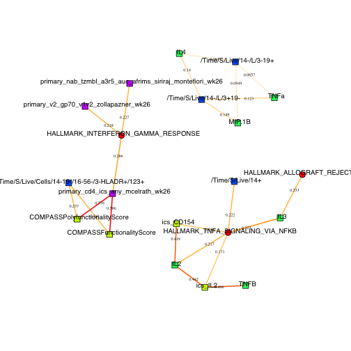

loading require packages

```r
suppressPackageStartupMessages(library(package = "knitr"))
suppressPackageStartupMessages(library(package = "igraph"))
suppressPackageStartupMessages(library(package = "mixOmics6.0"))
suppressPackageStartupMessages(library(package = "Biobase"))
suppressPackageStartupMessages(library(package = "readr"))
suppressPackageStartupMessages(library(package = "ggplot2"))
suppressPackageStartupMessages(library(package = "dplyr"))
suppressPackageStartupMessages(library(package = "tidyr"))
```

set default options/variables

```r
workDir <- dirname(getwd())
opts_chunk$set(tidy = FALSE, fig.path = "../figure/")
options(stringsAsFactors = FALSE,
        width            = 80,
        readr.num_columns = 0)
```

read clinical annotation

```r
clinicalAnnotFile <- file.path(workDir, "input/rv144.master_wk26.csv")
clinicalAnnotation <- read_csv(file = clinicalAnnotFile,
                               col_types = paste(rep("c", times = 21),
                                   collapse = ""))
clinicalAnnotation <- lapply(clinicalAnnotation,
                             FUN   = type.convert,
                             as.is = TRUE) %>%
                      data.frame(check.names = FALSE)
# remove unused columns
clinicalAnnotation <- clinicalAnnotation %>%
  select(-v7, -v9)
rownames(clinicalAnnotation) <- clinicalAnnotation$pin
```


read primary correlates and create ExpressionSet

```r
primCorrelatesFile <- file.path(workDir,
                                "input",
                                "rv144.primary_correlates_scaled_wk26.csv")
primCorrelates <- read_csv(file = primCorrelatesFile)
# select only the six primarary correlates and exclude variables transformed to
# categorical values
primCorrelatesMat <- primCorrelates %>%
  select(starts_with("primary"), -ends_with("cat"), -ends_with("imp")) %>%
  as.matrix() %>%
  t()
colnames(primCorrelatesMat) <- primCorrelates$pin
primCorrelatesAnnot <- clinicalAnnotation[as.character(primCorrelates$pin), ]
primCorrelatesSet <- ExpressionSet(assayData = primCorrelatesMat,
                                   phenoData =
                                   AnnotatedDataFrame(primCorrelatesAnnot))
# print ExpressionSet
print(primCorrelatesSet)
```

```
## ExpressionSet (storageMode: lockedEnvironment)
## assayData: 6 features, 246 samples 
##   element names: exprs 
## protocolData: none
## phenoData
##   sampleNames: 104173 107034 ... 852086 (246 total)
##   varLabels: pin dem_sex ... cc_cohort (19 total)
##   varMetadata: labelDescription
## featureData: none
## experimentData: use 'experimentData(object)'
## Annotation:
```

```r
# save primary correlates ExpressionSet
save(primCorrelatesSet,
     file = file.path(workDir, "output/rv144.primCorrelatesSet.RData"))
```

read sorted cell counts, samples annotation and features annotation

```r
phenotypeFile <- file.path(workDir, "input/rv144.phenotype_counts.csv")
phenotype <- read_csv(file = phenotypeFile)
phenotypeSamplesAnnotFile <- file.path(workDir,
                                       "input",
                                       "rv144.phenotype_samples_annotation.csv")
phenotypeSamplesAnnotation <- read_csv(file = phenotypeSamplesAnnotFile)
phenotypeFeatsAnnotFile <- file.path(workDir,
                                     "input",
                                     "rv144.phenotype_features_annotation.csv")
phenotypeFeaturesAnnotation <- read_csv(file = phenotypeFeatsAnnotFile) %>%
  as.data.frame()
rownames(phenotypeFeaturesAnnotation) <- phenotypeFeaturesAnnotation$path
```


```r
# create raw phenotype expressionset
phenotypeMat <- phenotype %>%
  select(-rowname) %>%
  as.matrix()
rownames(phenotypeMat) <- phenotype$rowname
phenotypeSamplesAnnotation <- phenotypeSamplesAnnotation %>%
  merge(y = clinicalAnnotation, by.x = "PTID", by.y = "pin", all.x = TRUE) %>%
  rename(pin = PTID) %>%
  as.data.frame()
rownames(phenotypeSamplesAnnotation) <- phenotypeSamplesAnnotation$File
phenotypeSamplesAnnotation <-
  phenotypeSamplesAnnotation[colnames(phenotypeMat), ]
phenotypeFeaturesAnnotation <- phenotypeFeaturesAnnotation %>%
  as.data.frame()
rownames(phenotypeFeaturesAnnotation) <- phenotypeFeaturesAnnotation$path
phenotypeFeaturesAnnotation <-
  phenotypeFeaturesAnnotation[rownames(phenotypeMat), ]
phenotypeRawSet <- ExpressionSet(
    assayData = phenotypeMat,
    phenoData = AnnotatedDataFrame(phenotypeSamplesAnnotation),
    featureData = AnnotatedDataFrame(phenotypeFeaturesAnnotation))
# save raw phenotype ExpressionSet
save(phenotypeRawSet,
     file = file.path(workDir, "output/rv144.phenotypeRawSet.RData"))
# exclude samples not from the RV144 case/ctrl study
phenotypeSet <- phenotypeRawSet[, !is.na(phenotypeRawSet$pin)]
# use live cells counts to normalize cells
phenotypeMat <- exprs(phenotypeSet)
exprs(phenotypeSet) <- t(t(phenotypeMat) / phenotypeMat["/Time/S/Live", ])
# add live cells counts to the samples data
phenotypeSet$"/Time/S/Live" <- phenotypeMat["/Time/S/Live", ]
# exclude not-used subsets
phenotypeSet <- phenotypeSet[!(fData(phenotypeSet)$popName %in%
                               c("Live", "L", "3-19-", "3-HLADR+")), ]
# print ExpressionSet
print(phenotypeSet)
```

```
## ExpressionSet (storageMode: lockedEnvironment)
## assayData: 6 features, 258 samples 
##   element names: exprs 
## protocolData: none
## phenoData
##   sampleNames: 221690.fcs 221692.fcs ... 252490.fcs (258 total)
##   varLabels: pin File ... /Time/S/Live (24 total)
##   varMetadata: labelDescription
## featureData
##   featureNames: /Time/S/Live/14+ /Time/S/Live/14-/L/3-19+ ...
##     /Time/S/Live/14-/L/3+19- (6 total)
##   fvarLabels: path popName
##   fvarMetadata: labelDescription
## experimentData: use 'experimentData(object)'
## Annotation:
```

```r
# save normalized phenotype ExpressionSet
save(phenotypeSet,
     file = file.path(workDir, "output/rv144.phenotypeSet.RData"))
```


read luminex data and create ExpressionSet

```r
luminexFile <- file.path(workDir, "input/rv144.luminex.csv")
luminex <- read_csv(file = luminexFile)
# select only the six primarary correlates and exclude variables transformed to
# categorical values
luminexMat <- luminex %>%
  select(-PTID) %>%
  as.matrix() %>%
  t()
colnames(luminexMat) <- luminex$PTID
luminexAnnot <- clinicalAnnotation[as.character(luminex$PTID), ]
luminexSet <- ExpressionSet(assayData = luminexMat,
                            phenoData =
                            AnnotatedDataFrame(luminexAnnot))
# print ExpressionSet
print(luminexSet)
```

```
## ExpressionSet (storageMode: lockedEnvironment)
## assayData: 12 features, 262 samples 
##   element names: exprs 
## protocolData: none
## phenoData
##   sampleNames: 104173 107034 ... 852086 (262 total)
##   varLabels: pin dem_sex ... cc_cohort (19 total)
##   varMetadata: labelDescription
## featureData: none
## experimentData: use 'experimentData(object)'
## Annotation:
```

```r
# save primary correlates ExpressionSet
save(luminexSet, file = file.path(workDir, "output/rv144.luminexSet.RData"))
```

read intracellular cytokine staining and create ExpressionSet

```r
icsFile <- file.path(workDir, "input/rv144.compass_ics_scaled.csv")
ics <- read_csv(file = icsFile)
# select only the six primarary correlates and exclude variables transformed to
# categorical values
icsMat <- ics %>%
  select(-pin, -PUBID, -PTID) %>%
  as.matrix() %>%
  t()
colnames(icsMat) <- ics$pin
icsAnnot <- clinicalAnnotation[as.character(ics$pin), ]
icsSet <- ExpressionSet(assayData = icsMat,
                            phenoData =
                            AnnotatedDataFrame(icsAnnot))
# print ExpressionSet
print(icsSet)
```

```
## ExpressionSet (storageMode: lockedEnvironment)
## assayData: 8 features, 226 samples 
##   element names: exprs 
## protocolData: none
## phenoData
##   sampleNames: 107034 110256 ... 852086 (226 total)
##   varLabels: pin dem_sex ... cc_cohort (19 total)
##   varMetadata: labelDescription
## featureData: none
## experimentData: use 'experimentData(object)'
## Annotation:
```

```r
# save primary correlates ExpressionSet
save(icsSet, file = file.path(workDir, "output/rv144.icsSet.RData"))
```

read haplotype and create ExpressionSet

```r
haplotypeFile <- file.path(workDir, "input/rv144.haplotype.csv")
haplotype <- read_csv(file = haplotypeFile)
# select only the six primarary correlates and exclude variables transformed to
# categorical values
haplotypeMat <- haplotype %>%
  select(-Pid) %>%
  as.matrix() %>%
  t()
colnames(haplotypeMat) <- haplotype$Pid
haplotypeAnnot <- clinicalAnnotation[as.character(haplotype$Pid), ]
haplotypeSet <- ExpressionSet(assayData = haplotypeMat,
                            phenoData =
                            AnnotatedDataFrame(haplotypeAnnot))
# print ExpressionSet
print(haplotypeSet)
```

```
## ExpressionSet (storageMode: lockedEnvironment)
## assayData: 31 features, 210 samples 
##   element names: exprs 
## protocolData: none
## phenoData
##   sampleNames: 220187 417372 ... 354609 (210 total)
##   varLabels: pin dem_sex ... cc_cohort (19 total)
##   varMetadata: labelDescription
## featureData: none
## experimentData: use 'experimentData(object)'
## Annotation:
```

```r
# save primary correlates ExpressionSet
save(haplotypeSet, file = file.path(workDir, "output/rv144.haplotypeSet.RData"))
```

load genesets ExpressionSet

```r
gsSetFile <- file.path(workDir, "output/rv144.gsSet.RData")
load(file = gsSetFile)
# add donor ID to phenotypic annotation
gsSet$pin <- gsSet$donor
```

combine all measurement for vaccinees

```r
clinicalAnnotation <- filter(clinicalAnnotation, trt %in% "VACCINE")
allMat <- keyClass <- NULL
for (omic in setdiff(ls(pattern = "Set$"), "phenotypeRawSet")) {
  # print(omic)
  eval(parse(text = paste("eset <-", omic)))
  allMat <- rbind(allMat,
                  exprs(eset)[,
                              match(clinicalAnnotation$pin,
                                    table = eset$pin),
                              drop = FALSE])
  keyClass <- c(keyClass,
               rep(gsub(pattern = "Set$", replacement = "", omic),
                   times = nrow(eset)))
}
colnames(allMat) <- clinicalAnnotation$pin
# remove columns with only missing values
flag <- colSums(is.na(allMat)) == nrow(allMat)
allMat <- allMat[, -which(flag)]
```

determine if variables is binary, categorical or continuous

```r
flagDF <- t(allMat) %>%
  as.data.frame() %>%
  gather(key, value) %>%
  group_by(key) %>%
  summarize(isUnique = length(table(value)) <= 1,
            isBinary = max(sort(table(value))) >=
            length(value) * 0.25,
            cutoff = names(sort(table(value, exclude = NULL),
                decreasing = TRUE))[1],
            isCateg = length(table(value, exclude = NULL)) <=
            length(value) * 0.25,
            isContinuous = length(na.omit(suppressWarnings(
                as.numeric(value)))) >= length(value) * 0.25) %>%
  mutate(type = ifelse(test = isUnique, yes = NA, no = ""),
         type = ifelse(test = !isUnique & isBinary,
             yes = "binary",
             no  = type),
         type = ifelse(test = type %in% "" & isCateg,
             yes = "categorical",
             no  = type),
         type = ifelse(test = type %in% "" & isContinuous,
             yes = "continuous",
             no  = type),
         type = ifelse(test = type %in% "",
             yes = NA,
             no = type),
         key = as.vector(key)) %>%
  as.data.frame()
flagDF <- flagDF[match(rownames(allMat), flagDF$key), ]
flagDF$class <- keyClass
```


assess correlation between variables


projection-based integrative analysis

```r
enrichedGS <- c("HALLMARK_INTERFERON_GAMMA_RESPONSE",
                "HALLMARK_ALLOGRAFT_REJECTION",
                "HALLMARK_MTORC1_SIGNALING",
                "HALLMARK_TNFA_SIGNALING_VIA_NFKB")
# for every pair of omics, identify complete set of participants
outLS <- list()
candidateOmics <- unique(flagDF$class)
for (i in 1:(length(candidateOmics) - 1)) {
  for (j in (i+1):length(candidateOmics)) {
    omic1 <- candidateOmics[i]
    omic2 <- candidateOmics[j]
    subDF <- t(allMat[flagDF$class %in% c(omic1, omic2) &
                      flagDF$type %in% "continuous", ])
    subFlagDF <- flagDF[flagDF$class %in% c(omic1, omic2) &
                        flagDF$type %in% "continuous", ]
    if (length(unique(subFlagDF$class)) > 1) {
      subDF <- subDF[complete.cases(subDF), ]
      splsFull <- spls(subDF[, subFlagDF$class %in% omic1, drop = FALSE],
                       subDF[, subFlagDF$class %in% omic2, drop = FALSE],
                       mode  = "regression",
                       scale = TRUE)
      set.seed(seed = 1)
      splsCV <- perf(splsFull,
                     validation = "loo",
                     progressBar = FALSE)
      nComp <- which.max(splsCV$Q2.total)
      keep.X <- apply(abs(splsFull$loadings$X), 1, sum) > 0
      keep.Y <- apply(abs(splsFull$loadings$Y), 1, sum) > 0
      cord.X <- cor(splsFull$X[, keep.X], splsFull$variates$X[, 1:nComp],
                    use = "pairwise")
      cord.Y <- cor(splsFull$Y[, keep.Y], splsFull$variates$X[, 1:nComp],
                    use = "pairwise")
      simFullMat <- cord.X %*% t(cord.Y)
      rThreshold <- quantile(as.numeric(simFullMat), probs = 0.975)
      if (rThreshold > 0) {
          net <- network(splsFull,
                       comp = 1:2,
                       threshold = rThreshold)
          outLS[[paste0(omic1, "_", omic2)]] <- net
      }
    }
  }
}
```


```r
# igraph with positive correlation
gR <- outLS[[1]]$gR
igraph::V(gR)$name <- V(gR)$label
for (i in 2:(length(outLS) - 1)) {
  gtemp <- outLS[[i]]$gR
  V(gtemp)$name <- V(gtemp)$label
  g1v <- get.data.frame(gR, what = "vertices")
  g2v <- get.data.frame(gtemp, what = "vertices")
  guv <- rbind(g1v, g2v)
  guv <- guv[!duplicated(guv[, "name"]), ]
  g1e <- get.data.frame(gR, what = "edges")
  g2e <- get.data.frame(gtemp, what = "edges")
  gue <- rbind(g1e, g2e)
  gR <- graph.data.frame(gue, directed = FALSE, vertices = guv)
}
toDelete <- igraph::V(gR)$label
toDelete <- data.frame(key   = toDelete,
                       class = flagDF$class[match(toDelete, flagDF$key)]) %>%
  mutate(to.delete = ifelse(test = class %in% "gs" & !(key %in% enrichedGS),
             yes = "yes",
             no  = "no"))
gR <- igraph::delete.vertices(gR, which(toDelete$to.delete %in% "yes"))
gR <- igraph::delete.edges(gR, which(igraph::E(gR)$weight < 0))
gR <- igraph::delete.vertices(gR, which(igraph::degree(gR) < 1))
set.seed(seed = 1)
V(gR)$class <- flagDF$class[match(V(gR)$label, table = flagDF$key)]
vShape <- ifelse(test = V(gR)$class %in% "gs", yes = "circle", no = "square")
vColor <- rainbow(n = length(unique(V(gR)$class)))
vColor <- vColor[match(V(gR)$class, table = unique(V(gR)$class))]
eColor <- findInterval(E(gR)$weight,
                       vec = seq(from = 0, to = 0.6, by = 0.05))
eColor <- colorRampPalette(c("white", "orange",  "red"))(13)[eColor]
plot.igraph(gR,
            vertex.size       = 5,
            vertex.shape      = vShape,
            vertex.color      = vColor,
            vertex.label.cex  = 0.8,
            vertex.label.dist = 1/3,
            edge.label        = signif(E(gR)$weight, digits = 3),
            edge.label.cex    = 0.5,
            edge.color        = eColor,
            edge.width        = 2)
```



print session info

```r
sessionInfo()
```

```
## R version 3.5.1 (2018-07-02)
## Platform: x86_64-apple-darwin17.6.0 (64-bit)
## Running under: macOS  10.14
## 
## Matrix products: default
## BLAS: /System/Library/Frameworks/Accelerate.framework/Versions/A/Frameworks/vecLib.framework/Versions/A/libBLAS.dylib
## LAPACK: /System/Library/Frameworks/Accelerate.framework/Versions/A/Frameworks/vecLib.framework/Versions/A/libLAPACK.dylib
## 
## locale:
## [1] en_US.UTF-8/en_US.UTF-8/en_US.UTF-8/C/en_US.UTF-8/en_US.UTF-8
## 
## attached base packages:
## [1] parallel  stats     graphics  grDevices utils     datasets  methods  
## [8] base     
## 
## other attached packages:
##  [1] bindrcpp_0.2.2      tidyr_0.8.1         dplyr_0.7.6        
##  [4] readr_1.1.1         Biobase_2.40.0      BiocGenerics_0.26.0
##  [7] mixOmics6.0_6.0.0   ggplot2_3.0.0       lattice_0.20-35    
## [10] MASS_7.3-50         igraph_1.2.2        knitr_1.20         
## 
## loaded via a namespace (and not attached):
##  [1] tidyselect_0.2.4        purrr_0.2.5             reshape2_1.4.3         
##  [4] colorspace_1.3-2        miniUI_0.1.1.1          htmltools_0.3.6        
##  [7] rlang_0.2.2             manipulateWidget_0.10.0 later_0.7.5            
## [10] pillar_1.3.0            glue_1.3.0              withr_2.1.2            
## [13] RColorBrewer_1.1-2      bindr_0.1.1             plyr_1.8.4             
## [16] stringr_1.3.1           munsell_0.5.0           gtable_0.2.0           
## [19] htmlwidgets_1.2         evaluate_0.11           labeling_0.3           
## [22] httpuv_1.4.5            crosstalk_1.0.0         highr_0.7              
## [25] Rcpp_0.12.18            xtable_1.8-3            corpcor_1.6.9          
## [28] scales_1.0.0            promises_1.0.1          webshot_0.5.0          
## [31] jsonlite_1.5            mime_0.5                ellipse_0.4.1          
## [34] hms_0.4.2               digest_0.6.17           stringi_1.2.4          
## [37] shiny_1.1.0             grid_3.5.1              tools_3.5.1            
## [40] magrittr_1.5            rgl_0.99.16             lazyeval_0.2.1         
## [43] tibble_1.4.2            crayon_1.3.4            pkgconfig_2.0.2        
## [46] assertthat_0.2.0        R6_2.2.2                compiler_3.5.1
```
