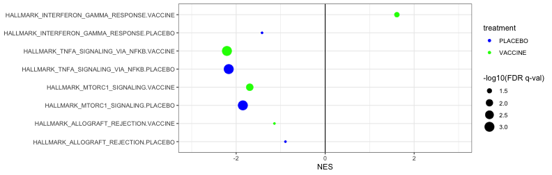

loading require packages

```r
suppressPackageStartupMessages(library(package = "knitr"))
suppressPackageStartupMessages(library(package = "ggplot2"))
suppressPackageStartupMessages(library(package = "dplyr"))
suppressPackageStartupMessages(library(package = "tidyr"))
suppressPackageStartupMessages(library(package = "tibble"))
```

set default options/variables

```r
workDir <- dirname(getwd())
opts_chunk$set(tidy = FALSE, fig.path = "../figure/")
options(stringsAsFactors  = FALSE,
        width             = 80,
        readr.num_columns = 0)
```

read gsea output directories

```r
gseaOutputFile <- file.path(workDir,
                            "output/rv144.gseaOutput.RData")
load(file = gseaOutputFile)
# print statistically significant enriched genesets for the placebo group
gseaOutput %>%
  filter(grepl(pattern = "PLACEBO", coefficient) & `FDR q-val` <= 0.05) %>%
  select(coefficient, NAME, NES, `FDR q-val`) %>%
  arrange(desc(sign(NES)), `FDR q-val`) %>%
  as.data.frame() %>%
  print()
```

```
##              coefficient                               NAME       NES
## 1 PLACEBO_No-PLACEBO_Yes                   HALLMARK_HYPOXIA -2.040240
## 2 PLACEBO_No-PLACEBO_Yes   HALLMARK_TNFA_SIGNALING_VIA_NFKB -2.167539
## 3 PLACEBO_No-PLACEBO_Yes HALLMARK_UNFOLDED_PROTEIN_RESPONSE -1.900919
## 4 PLACEBO_No-PLACEBO_Yes          HALLMARK_MTORC1_SIGNALING -1.850100
## 5 PLACEBO_No-PLACEBO_Yes     HALLMARK_INFLAMMATORY_RESPONSE -1.624006
## 6 PLACEBO_No-PLACEBO_Yes    HALLMARK_ESTROGEN_RESPONSE_LATE -1.526873
##      FDR q-val
## 1 0.0000000000
## 2 0.0000000000
## 3 0.0006212122
## 4 0.0008601399
## 5 0.0165918560
## 6 0.0440113880
```

```r
# print statistically significant enriched genesets for the vaccine group
gseaOutput %>%
  filter(grepl(pattern = "VACCINE", coefficient) & `FDR q-val` <= 0.05) %>%
  select(coefficient, NAME, NES, `FDR q-val`) %>%
  arrange(desc(sign(NES)), `FDR q-val`) %>%
  as.data.frame() %>%
  print()
```

```
##               coefficient                               NAME       NES
## 1  VACCINE_No-VACCINE_Yes HALLMARK_INTERFERON_ALPHA_RESPONSE  2.224985
## 2  VACCINE_No-VACCINE_Yes HALLMARK_INTERFERON_GAMMA_RESPONSE  1.611962
## 3  VACCINE_No-VACCINE_Yes            HALLMARK_MYC_TARGETS_V1 -2.103227
## 4  VACCINE_No-VACCINE_Yes   HALLMARK_TNFA_SIGNALING_VIA_NFKB -2.208247
## 5  VACCINE_No-VACCINE_Yes         HALLMARK_ANDROGEN_RESPONSE -1.860506
## 6  VACCINE_No-VACCINE_Yes               HALLMARK_E2F_TARGETS -1.680729
## 7  VACCINE_No-VACCINE_Yes          HALLMARK_MTORC1_SIGNALING -1.695250
## 8  VACCINE_No-VACCINE_Yes     HALLMARK_INFLAMMATORY_RESPONSE -1.613153
## 9  VACCINE_No-VACCINE_Yes HALLMARK_OXIDATIVE_PHOSPHORYLATION -1.564661
## 10 VACCINE_No-VACCINE_Yes            HALLMARK_MYC_TARGETS_V2 -1.545885
## 11 VACCINE_No-VACCINE_Yes            HALLMARK_UV_RESPONSE_DN -1.495664
## 12 VACCINE_No-VACCINE_Yes HALLMARK_UNFOLDED_PROTEIN_RESPONSE -1.448732
## 13 VACCINE_No-VACCINE_Yes                HALLMARK_DNA_REPAIR -1.451239
## 14 VACCINE_No-VACCINE_Yes     HALLMARK_FATTY_ACID_METABOLISM -1.461613
## 15 VACCINE_No-VACCINE_Yes            HALLMARK_G2M_CHECKPOINT -1.427218
## 16 VACCINE_No-VACCINE_Yes                   HALLMARK_HYPOXIA -1.408479
##       FDR q-val
## 1  0.0000000000
## 2  0.0280913060
## 3  0.0000000000
## 4  0.0000000000
## 5  0.0009074074
## 6  0.0074106874
## 7  0.0089333600
## 8  0.0134427980
## 9  0.0206919460
## 10 0.0221957960
## 11 0.0340970680
## 12 0.0374252950
## 13 0.0403314120
## 14 0.0414474530
## 15 0.0426526960
## 16 0.0488512100
```

plot normalized enrichement score

```r
gsNames <- c("HALLMARK_ALLOGRAFT_REJECTION",
             "HALLMARK_INTERFERON_GAMMA_RESPONSE",
             "HALLMARK_MTORC1_SIGNALING",
             "HALLMARK_TNFA_SIGNALING_VIA_NFKB")
plotDF <- gseaOutput %>%
  mutate(treatment = gsub(pattern = "([^_]+).+",
             replacement = "\\1",
             coefficient),
         `FDR q-val` = pmax(`FDR q-val`, 1e-03),
         `-log10(FDR q-val)` = -1 * log10(`FDR q-val`),
         `-log10(FDR q-val)` = pmax(`-log10(FDR q-val)`, -log10(0.05))) %>%
  select(NAME, treatment, NES, `-log10(FDR q-val)`) %>%
  filter(NAME %in% gsNames) %>%
  arrange(grepl(pattern = "INTERFERON", NAME), NAME) %>%
  mutate(NAME = paste0(NAME, ".", treatment),
         NAME = factor(NAME, levels = unique(NAME)))

ggplot(plotDF,
       aes(x = NES, y = NAME, color = treatment)) +
  geom_point(mapping = aes(size = `-log10(FDR q-val)`)) +
  geom_vline(xintercept = 0) +
  labs(y = NULL) +
  scale_x_continuous(limits = c(-3, 3)) +
  scale_color_manual(values = c(VACCINE = "green", PLACEBO = "blue")) +
  scale_size_continuous(range = c(1, 6)) +
  theme_bw() +
  theme(legend.key = element_blank())
```



print session info

```r
sessionInfo()
```

```
## R version 3.5.1 (2018-07-02)
## Platform: x86_64-apple-darwin17.6.0 (64-bit)
## Running under: macOS  10.14
## 
## Matrix products: default
## BLAS: /System/Library/Frameworks/Accelerate.framework/Versions/A/Frameworks/vecLib.framework/Versions/A/libBLAS.dylib
## LAPACK: /System/Library/Frameworks/Accelerate.framework/Versions/A/Frameworks/vecLib.framework/Versions/A/libLAPACK.dylib
## 
## locale:
## [1] en_US.UTF-8/en_US.UTF-8/en_US.UTF-8/C/en_US.UTF-8/en_US.UTF-8
## 
## attached base packages:
## [1] stats     graphics  grDevices utils     datasets  methods   base     
## 
## other attached packages:
## [1] bindrcpp_0.2.2 tibble_1.4.2   tidyr_0.8.1    dplyr_0.7.6    ggplot2_3.0.0 
## [6] knitr_1.20    
## 
## loaded via a namespace (and not attached):
##  [1] Rcpp_0.12.18     bindr_0.1.1      magrittr_1.5     tidyselect_0.2.4
##  [5] munsell_0.5.0    colorspace_1.3-2 R6_2.2.2         rlang_0.2.2     
##  [9] highr_0.7        stringr_1.3.1    plyr_1.8.4       tools_3.5.1     
## [13] grid_3.5.1       gtable_0.2.0     withr_2.1.2      digest_0.6.17   
## [17] lazyeval_0.2.1   assertthat_0.2.0 crayon_1.3.4     purrr_0.2.5     
## [21] glue_1.3.0       evaluate_0.11    labeling_0.3     stringi_1.2.4   
## [25] compiler_3.5.1   pillar_1.3.0     scales_1.0.0     pkgconfig_2.0.2
```
