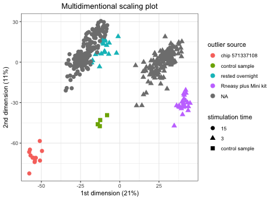
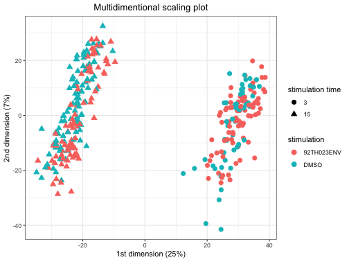
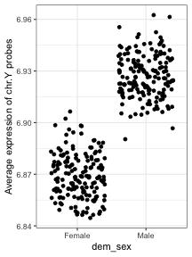
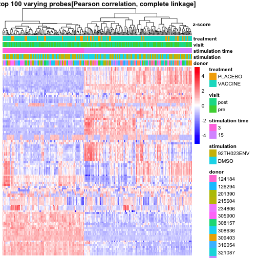
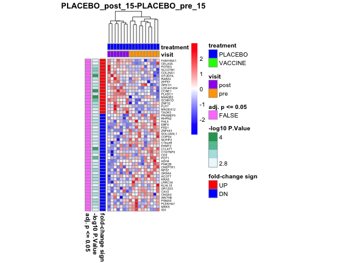
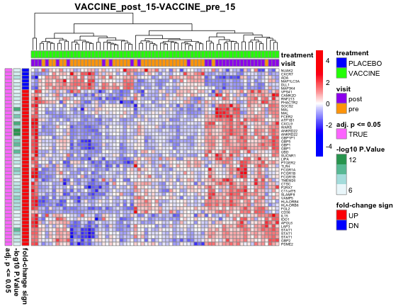
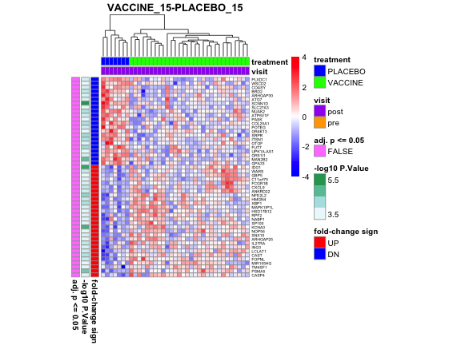

loading require packages

```r
suppressPackageStartupMessages(library(package = "readr"))
suppressPackageStartupMessages(library(package = "Biobase"))
suppressPackageStartupMessages(library(package = "impute"))
suppressPackageStartupMessages(library(package = "org.Hs.eg.db"))
suppressPackageStartupMessages(library(package = "ggplot2"))
suppressPackageStartupMessages(library(package = "limma"))
suppressPackageStartupMessages(library(package = "statmod"))
suppressPackageStartupMessages(library(package = "knitr"))
suppressPackageStartupMessages(library(package = "pheatmap"))
suppressPackageStartupMessages(library(package = "grid"))
suppressPackageStartupMessages(library(package = "gtable"))
suppressPackageStartupMessages(library(package = "RCurl"))
suppressPackageStartupMessages(library(package = "dplyr"))
suppressPackageStartupMessages(library(package = "tidyr"))
suppressPackageStartupMessages(library(package = "tibble"))
```

set default options/variables

```r
workDir <- dirname(getwd())
opts_chunk$set(tidy = FALSE)
opts_chunk$set(fig.path = "../figure/")
options(stringsAsFactors  = FALSE,
        width             = 80,
        mc.cores          = detectCores() - 1,
        readr.num_columns = 0)
```

read non-normalized matrix

```r
rawFile <- file.path(workDir, 
                     "input",
                     "GA_illumina_expression.rv144pilot.matrix_non_norm.csv")
rawMat <- read_csv(file = rawFile, progress = FALSE)
```

read arrays annotation

```r
arraysAnnotFile <- file.path(workDir,
                             "input",
                             "GA_illumina_expression.rv144pilot.metadata.csv")
arraysAnnotation <- read_csv(file = arraysAnnotFile)
# remove unused phenotypic information
arraysAnnotation <- select(arraysAnnotation,
                           -title,
                           -`source name`,
                           -organism,
                           -molecule,
                           -label,
                           -description,
                           -platform)
# remove prefix 'characteristics` of column names
names(arraysAnnotation) <- gsub(pattern = "^[^:]+: (.+)$",
                                replacement = "\\1",
                                names(arraysAnnotation))
```

read features annotation

```r
featuresAnnotFile <- file.path(workDir,
                               "input/Illumina_HumanHT12_V4.hg19.chip")
featuresAnnotation <- read_tsv(file = featuresAnnotFile) %>%
  as.data.frame()
rownames(featuresAnnotation) <- featuresAnnotation$IlmnID
```

read clinical annotation

```r
clinicalAnnotFile <- file.path(workDir,
                               "input/rv144.master_wk26.csv")
clinicalAnnotation <- read_csv(file      = clinicalAnnotFile,
                               col_types = paste(rep("c", times = 21),
                                                 collapse = ""))
clinicalAnnotation <- lapply(clinicalAnnotation,
                             FUN   = type.convert,
                             as.is = TRUE) %>%
                      data.frame(check.names = FALSE)
# remove unused columns
clinicalAnnotation <- clinicalAnnotation %>%
  select(-v7, -v9)
rownames(clinicalAnnotation) <- clinicalAnnotation$pin
```

create non-normalized ExpressionSet

```r
# format raw matrix
rNames <- rawMat$"ID_REF"
rawMat <- rawMat[, -grep(pattern = "ID_REF|Detection Pval",
                         colnames(rawMat))]
rawMat <- as.matrix(rawMat)
rownames(rawMat) <- rNames
# format phenodata
arraysAnnotation <- as.data.frame(arraysAnnotation)
rownames(arraysAnnotation) <- arraysAnnotation$"Sample name"
arraysAnnotation <- arraysAnnotation[colnames(rawMat), ]
# format feature annotation
featuresAnnotation <- as.data.frame(featuresAnnotation)
featuresAnnotation <- featuresAnnotation[rownames(rawMat), ]
# create ExpressionSet
esetRaw <- ExpressionSet(assayData   = rawMat,
                         phenoData   = AnnotatedDataFrame(arraysAnnotation),
                         featureData = AnnotatedDataFrame(featuresAnnotation))
# save raw ExpressionSet
save(esetRaw, file = file.path(workDir, "output/rv144pilot.esetRaw.RData"))
```

quality control: multidimentional scaling plot

```r
# create data.frame with arrays annotation
plotDF <- pData(esetRaw) %>%
  mutate(`outlier source` = ifelse(test =
             grepl(pattern = "5713317108", `idat file`),
             yes = "chip 571337108",
             no  = NA),
         `outlier source` = ifelse(test =
             grepl(pattern = "control", `Sample name`),
             yes = "control sample",
             no  = `outlier source`),
         `outlier source` = ifelse(test =
             `post-thraw resting` %in% "rested overnight",
             yes = "rested overnight",
             no  = `outlier source`),
         `outlier source` = ifelse(test =
             grepl(pattern = "Rneasy", `RNA extraction protocol`),
             yes = "Rneasy plus Mini kit",
             no  = `outlier source`),
         `stimulation time` = ifelse(test =
             grepl(pattern = "control", `Sample name`),
             yes = "control sample",
             no  = `stimulation time`),
         `stimulation time` = factor(`stimulation time`))
# create tempory ExpressionSet and normalize the data
esetTemp <- esetRaw
rawMat <- exprs(esetTemp)
normMat <- normalizeBetweenArrays(rawMat, method = "quantile")
normMat <- log2(normMat)
# generate a multidimensional scaling plot
distMat <- dist(t(normMat))
mds <- cmdscale(d = distMat, k = ncol(normMat) - 1, eig = TRUE)
mdsStDev <- apply(mds$points, MARGIN = 2, FUN = sd)
mdsPercVar <- round((mdsStDev^2)/sum(mdsStDev^2) * 100)
plotDF <- plotDF %>%
  mutate(V1 = mds$points[, 1],
         V2 = mds$points[, 2])
# color dots by whether a sample is an outlier and shape by stimulation time
qcMdS <- ggplot(data = plotDF,
                mapping = aes(x = V1,
                    y     = V2,
                    color = `outlier source`,
                    shape = `stimulation time`)) +
         geom_point(size = 3) +
         labs(x     = paste0("1st dimension (", mdsPercVar[1], "%)"),
              y     = paste0("2nd dimension (", mdsPercVar[2], "%)"),
              title = "Multidimentional scaling plot") +
         theme_bw() +
         theme(legend.key = element_blank(),
               plot.title = element_text(hjust = 0.5))
print(qcMdS)
```



```r
# print outlier array names
outlierArrays <- plotDF %>%
  filter(!is.na(`outlier source`)) %>%
  select(`Sample name`, `outlier source`) %>%
  arrange(`outlier source`)
print(outlierArrays)
```

```
##                          Sample name       outlier source
## 1  RV144_d600077_post_92TH023ENV_15h       chip 571337108
## 2  RV144_d601471_post_92TH023ENV_15h       chip 571337108
## 3  RV144_d605022_post_92TH023ENV_15h       chip 571337108
## 4  RV144_d610097_post_92TH023ENV_15h       chip 571337108
## 5  RV144_d611459_post_92TH023ENV_15h       chip 571337108
## 6  RV144_d611510_post_92TH023ENV_15h       chip 571337108
## 7  RV144_d615235_post_92TH023ENV_15h       chip 571337108
## 8  RV144_d617107_post_92TH023ENV_15h       chip 571337108
## 9  RV144_d627471_post_92TH023ENV_15h       chip 571337108
## 10       RV144_d503474_post_DMSO_15h       chip 571337108
## 11       RV144_d600077_post_DMSO_15h       chip 571337108
## 12       RV144_d124184_post_DMSO_15h       chip 571337108
## 13                     RV144_control       control sample
## 14                RV144_control_rep1       control sample
## 15                RV144_control_rep2       control sample
## 16                RV144_control_rep3       control sample
## 17   RV144_d726470_pre_92TH023ENV_3h     rested overnight
## 18   RV144_d804141_pre_92TH023ENV_3h     rested overnight
## 19   RV144_d816509_pre_92TH023ENV_3h     rested overnight
## 20   RV144_d822653_pre_92TH023ENV_3h     rested overnight
## 21  RV144_d823015_post_92TH023ENV_3h     rested overnight
## 22         RV144_d726470_pre_DMSO_3h     rested overnight
## 23         RV144_d804141_pre_DMSO_3h     rested overnight
## 24         RV144_d816509_pre_DMSO_3h     rested overnight
## 25         RV144_d822653_pre_DMSO_3h     rested overnight
## 26        RV144_d823015_post_DMSO_3h     rested overnight
## 27  RV144_d726470_post_92TH023ENV_3h     rested overnight
## 28  RV144_d804141_post_92TH023ENV_3h     rested overnight
## 29  RV144_d816509_post_92TH023ENV_3h     rested overnight
## 30   RV144_d823015_pre_92TH023ENV_3h     rested overnight
## 31        RV144_d726470_post_DMSO_3h     rested overnight
## 32        RV144_d804141_post_DMSO_3h     rested overnight
## 33        RV144_d816509_post_DMSO_3h     rested overnight
## 34         RV144_d823015_pre_DMSO_3h     rested overnight
## 35         RV144_d824464_pre_DMSO_3h     rested overnight
## 36         RV144_d501766_pre_DMSO_3h Rneasy plus Mini kit
## 37         RV144_d503384_pre_DMSO_3h Rneasy plus Mini kit
## 38         RV144_d503474_pre_DMSO_3h Rneasy plus Mini kit
## 39         RV144_d600077_pre_DMSO_3h Rneasy plus Mini kit
## 40         RV144_d601471_pre_DMSO_3h Rneasy plus Mini kit
## 41         RV144_d605022_pre_DMSO_3h Rneasy plus Mini kit
## 42         RV144_d611459_pre_DMSO_3h Rneasy plus Mini kit
## 43         RV144_d611510_pre_DMSO_3h Rneasy plus Mini kit
## 44         RV144_d615235_pre_DMSO_3h Rneasy plus Mini kit
## 45         RV144_d627471_pre_DMSO_3h Rneasy plus Mini kit
## 46         RV144_d628785_pre_DMSO_3h Rneasy plus Mini kit
## 47         RV144_d630802_pre_DMSO_3h Rneasy plus Mini kit
## 48        RV144_d501766_post_DMSO_3h Rneasy plus Mini kit
## 49        RV144_d503384_post_DMSO_3h Rneasy plus Mini kit
## 50        RV144_d503474_post_DMSO_3h Rneasy plus Mini kit
## 51        RV144_d600077_post_DMSO_3h Rneasy plus Mini kit
## 52        RV144_d601471_post_DMSO_3h Rneasy plus Mini kit
## 53        RV144_d605022_post_DMSO_3h Rneasy plus Mini kit
## 54        RV144_d610097_post_DMSO_3h Rneasy plus Mini kit
## 55        RV144_d611510_post_DMSO_3h Rneasy plus Mini kit
## 56        RV144_d615235_post_DMSO_3h Rneasy plus Mini kit
## 57        RV144_d627471_post_DMSO_3h Rneasy plus Mini kit
## 58        RV144_d628785_post_DMSO_3h Rneasy plus Mini kit
```

quality control: multidimentional scaling plot excluding outlier chips

```r
# create tempory ExpressionSet and normalize the data
esetTemp <- esetRaw
# exclude problematic arrays
esetTemp <- esetTemp[, setdiff(sampleNames(esetTemp),
                               outlierArrays$"Sample name")]
rawMat <- exprs(esetTemp)
normMat <- normalizeBetweenArrays(rawMat, method = "quantile")
normMat <- log2(normMat)
# generate a multidimensional scaling plot
distMat <- dist(t(normMat))
mds <- cmdscale(d = distMat, k = ncol(normMat) - 1, eig = TRUE)
mdsStDev <- apply(mds$points, MARGIN = 2, FUN = sd)
mdsPercVar <- round((mdsStDev^2)/sum(mdsStDev^2) * 100)
plotDF <- pData(esetTemp) %>%
  mutate(V1 = mds$points[, 1],
         V2 = mds$points[, 2],
         `stimulation time` = factor(`stimulation time`))
# color dots by stimulation and shape by stimulation time
qcMdS <- ggplot(data = plotDF,
                mapping = aes(x = V1, y = V2, color = stimulation,
                    shape = `stimulation time`)) +
         geom_point(size = 3) +
         labs(x     = paste0("1st dimension (", mdsPercVar[1], "%)"),
              y     = paste0("2nd dimension (", mdsPercVar[2], "%)"),
              title = "Multidimentional scaling plot") +
         theme_bw() +
         theme(legend.key = element_blank(),
               plot.title = element_text(hjust = 0.5))
print(qcMdS)
```



normalizing raw expression

```r
eset <- esetRaw
# order esetRaw by idat file name and features by ProbeID
eset <- eset[order(as.numeric(fData(eset)$ProbeID)),
             order(eset$"idat file")]
# impute missing intensities (intensities = 0)
rawMat <- exprs(eset)
rawMat[rawMat == 0] <- NA
suppressWarnings(capture.output(rawMat <- impute.knn(data = rawMat)$data,
                                file = "/dev/null"))
exprs(eset) <- rawMat
# remove outlier
eset <- eset[, setdiff(sampleNames(eset), outlierArrays$"Sample name")]
# quantile normalized and log2 transform expression
normMat <- normalizeBetweenArrays(exprs(eset), method = "quantile")
# surrogate remplacement
normMat[normMat < 2^0.1] <- 2^0.1
normMat <- log2(normMat)
exprs(eset) <- normMat
# save normalized ExpressionSet
save(eset, file = file.path(workDir, "output/rv144pilot.eset.RData"))
```

quality control: gender check

```r
symbol2chr <- merge(as.data.frame(org.Hs.egSYMBOL),
                    as.data.frame(org.Hs.egCHR),
                    by = "gene_id")
pb2symbol <- strsplit(fData(eset)$SYMBOL, split = " /// ") %>%
  setNames(fData(eset)$IlmnID) %>%
  stack() %>%
  mutate(ind = as.vector(ind))
pb2chr <- merge(symbol2chr, pb2symbol, by.x = "symbol", by.y = "values")

pbY <- filter(pb2chr, chromosome %in% "Y") %>%
  .$ind

plotDF <- data.frame(mu = colMeans(exprs(eset)[pbY, ])) %>%
  rownames_to_column() %>%
  merge(pData(eset), by.x = "rowname", by.y = "Sample name") %>%
  merge(clinicalAnnotation, by.x = "donor", by.y = "pin")
ggplot(data = plotDF, mapping = aes(x = dem_sex, y = mu)) +
  geom_jitter() +
  labs(y = "Average expression of chr.Y probes") +
  theme_bw()
```



exploratory analysis: heatmap based on top 100 most varying transcripts

```r
bluered <- colorRampPalette(colors = c("blue", "white", "red"))
varList <- apply(exprs(eset), MARGIN = 1, FUN = var)
esetTemp <- eset[order(varList, decreasing = TRUE)[1:100], ]
esetTemp$donor <- factor(esetTemp$donor)
esetTemp$"stimulation time" <- factor(esetTemp$"stimulation time")
exploHeat <- pheatmap(mat            = exprs(esetTemp),
                      color          = bluered(100),
                      scale          = "row",
                      clustering_distance_rows = "correlation",
                      clustering_distance_cols = "correlation",
                      treeheight_row = 0,
                      annotation_col = pData(esetTemp)[,
                          c("donor",
                            "stimulation",
                            "stimulation time",
                            "visit",
                            "treatment")],
                      show_colnames  = FALSE,
                      show_rownames  = FALSE,
                      main           = paste0("top 100 varying probes",
                          "[Pearson correlation, complete linkage]"),
                      silent         = TRUE)
colorName <- textGrob("z-score", x = 0.5, y = 1.05, gp = gpar(fontface = "bold"))
exploHeat$gtable <- gtable_add_grob(exploHeat$gtable,
                                    colorName,
                                    t    = 3,
                                    l    = 5,
                                    b    = 5,
                                    clip = "off",
                                    name = "colorName")
grid.draw(exploHeat$gtable)
```



```r
# test association with stimulation time
tab <- table(cutree(exploHeat$tree_col, k = 3),
             interaction(esetTemp$stimulation,
                         esetTemp$"stimulation time"))
tab <- tab[, grepl(pattern = "15$", colnames(tab))]
tab <- tab[rowSums(tab) > 0, ]
fit <- fisher.test(tab)
print(tab)
```

```
##    
##     92TH023ENV.15 DMSO.15
##   1            59      37
##   2            31      59
```

```r
print(fit)
```

```
## 
## 	Fisher's Exact Test for Count Data
## 
## data:  tab
## p-value = 0.0002529
## alternative hypothesis: true odds ratio is not equal to 1
## 95 percent confidence interval:
##  1.600390 5.773605
## sample estimates:
## odds ratio 
##   3.015886
```

```r
# test for clustering of samples by participants
participantList <- esetTemp$donor[exploHeat$tree_col$order]
y <- sum(participantList[-length(participantList)] == participantList[-1])
# derive p-value using a 1000 fold permutation test
B <- 1000
yhat <- mclapply(1:B, function(seed) {
  set.seed(seed = seed)
  participantList <- sample(esetTemp$donor)
  return(value = sum(participantList[-length(participantList)] ==
             participantList[-1]))
})
print(paste0("permutation test: p<=", max(mean(unlist(yhat) >= y), 1/B)))
```

```
## [1] "permutation test: p<=0.001"
```

create a ENV-DMSO ExpressionSet

```r
# identify complete pair of ENV-DMSO stimulated samples
flag <- pData(eset) %>%
  select(`Sample name`,
         donor,
         visit,
         stimulation,
         `stimulation time`) %>%
  spread(stimulation, `Sample name`) %>%
  filter(complete.cases(.))
esetVehSubstracted <- eset[, flag$"92TH023ENV"]
exprs(esetVehSubstracted) <- exprs(esetVehSubstracted) - exprs(eset[, flag$DMSO])
# save ENV-DMSO expression
save(esetVehSubstracted,
     file = file.path(workDir, "output/rv144pilot.esetVehSubstract.RData"))
```

create a post-pre ExpressionSet

```r
# identify complete pair of ENV-DMSO stimulated samples
flag <- pData(esetVehSubstracted) %>%
  select(`Sample name`,
         donor,
         visit,
         `stimulation time`) %>%
  spread(visit, `Sample name`) %>%
  filter(complete.cases(.))
esetBaselined <- esetVehSubstracted[, flag$post]
exprs(esetBaselined) <- exprs(esetBaselined) -
  exprs(esetVehSubstracted[, flag$pre])
# save post-pre expression
save(esetBaselined,
     file = file.path(workDir, "output/rv144pilot.esetBaselined.RData"))
```

differential expression analysis: vaccine effect

```r
# create list to save linear models
fits <- list()
# identify genes differently expressed between week 26 and pre-vax
TreatmentVisitStim <- interaction(esetVehSubstracted$treatment,
                                  esetVehSubstracted$visit,
                                  esetVehSubstracted$"stimulation time",
                                  sep = "_")
design <- model.matrix(~0+TreatmentVisitStim)
colnames(design) <- gsub(pattern     = "TreatmentVisitStim",
                         replacement = "",
                         colnames(design))
rownames(design) <- sampleNames(esetVehSubstracted)
donor <- factor(esetVehSubstracted$donor)
corfit <- duplicateCorrelation(exprs(esetVehSubstracted),
                               design = design,
                               block  = donor)
fit <- lmFit(esetVehSubstracted,
             design      = design,
             block       = donor,
             correlation = corfit$consensus)
contrastMat <- makeContrasts(contrasts = c("PLACEBO_post_15-PLACEBO_pre_15",
                                 "VACCINE_post_15-VACCINE_pre_15"),
                             levels = fit$design)
fit2 <- contrasts.fit(fit = fit, contrasts = contrastMat)
fit2 <- eBayes(fit = fit2)
fits[["visit"]] <- list(fit = fit, fit2 = fit2)

# identify genes differently expressed between vaccine and placebo after 15h stim
TreatmentStim <- interaction(esetBaselined$treatment,
                             esetBaselined$"stimulation time",
                             sep = "_")
design <- model.matrix(~0+TreatmentStim)
colnames(design) <- gsub(pattern     = "TreatmentStim",
                         replacement = "",
                         colnames(design))
rownames(design) <- sampleNames(esetBaselined)
# fit a fixed effect to the treatment/strim in the linear regression model
fit <- lmFit(esetBaselined, design = design)
contrastMat <- makeContrasts(contrasts = "VACCINE_15-PLACEBO_15",
                             levels = fit$design)
fit2 <- contrasts.fit(fit = fit, contrasts = contrastMat)
fit2 <- eBayes(fit = fit2)
# save MArrayLM in list
fits[["vaccine"]] <- list(fit = fit, fit2 = fit2)
# print number of genes differentially expressed
topTable(fit2, coef = "VACCINE_15-PLACEBO_15", number = Inf) %>%
  group_by(sign(logFC)) %>%
  summarize(p = sum(P.Value <= 0.05),
            adj.p = sum(adj.P.Val <= 0.05))
```

```
## # A tibble: 2 x 3
##   `sign(logFC)`     p adj.p
##           <dbl> <int> <int>
## 1            -1  1453     0
## 2             1  1493     0
```

```r
# save MArrayLM list
save(fits, file = file.path(workDir, "output/rv144pilot.fits.RData"))
```


```r
modelName <- "visit"
fit2 <- fits[[modelName]][["fit2"]]
for (coefName in colnames(fit2)) {
  coefLS <- unlist(strsplit(coefName, split = "-"))
  sampleLS <- fit2$design %>%
    as.data.frame() %>%
    rownames_to_column() %>%
    select_(.dots = c("rowname", coefLS)) %>%
    filter(apply(., MARGIN = 1, FUN = function(x) any(x %in% 1)))

  top <- topTable(fit    = fit2,
                  coef   = coefName,
                  number = Inf) %>%
         mutate(SYMBOL = gsub(pattern     = "^([^ ]+) ///.+",
                              replacement = "\\1",
                              SYMBOL)) %>%
         filter(SYMBOL != "---") %>%
         top_n(n = 50, wt = abs(t))
  exprsMat <- exprs(eset)[top$IlmnID, sampleLS$rowname] %>%
    (function(x) return(value = t(scale(t(x)))))
  breakLS <- c(-1 * max(abs(exprsMat)),
               seq(from       = -1 * min(abs(range(exprsMat))),
                   to         = min(abs(range(exprsMat))),
                   length.out = 99),
               max(abs(exprsMat)))
  colAnnotDF <- pData(eset) %>%
    .[, c("visit", "treatment")]
  rowAnnotDF <- top %>%
    mutate(`fold-change sign` = ifelse(test = sign(logFC) %in% 1,
                                       yes  = "UP",
                                       no  = "DN"),
           `-log10 P.Value` = -1 * log10(P.Value),
           `adj. p <= 0.05` = factor(adj.P.Val <= 0.05)) %>%
    select(IlmnID, `fold-change sign`, `-log10 P.Value`, `adj. p <= 0.05`)
  rownames(rowAnnotDF) <- rowAnnotDF$IlmnID
  rowAnnotDF$IlmnID <- NULL
  colorAnnotLS <- list(visit     = c(post = "purple", pre = "orange"),
                       treatment = c(PLACEBO = "blue", VACCINE = "green"),
                       "fold-change sign" = c(UP = "red", DN = "blue"))
  pheatmap(mat               = exprsMat,
           color             = bluered(100),
           breaks            = breakLS,
           cellwidth         = 5,
           cellheight        = 5,
           treeheight_row    = 0,
           annotation_col    = colAnnotDF,
           annotation_row    = rowAnnotDF,
           annotation_colors = colorAnnotLS,
           show_colnames     = FALSE,
           main              = coefName,
           fontsize_row      = 5,
           labels_row        = top$SYMBOL)
}
```




```r
modelName <- "vaccine"
fit2 <- fits[[modelName]][["fit2"]]
coefName <- colnames(fit2)
coefLS <- unlist(strsplit(coefName, split = "-"))
sampleLS <- fit2$design %>%
  as.data.frame() %>%
  rownames_to_column() %>%
  select_(.dots = c("rowname", coefLS)) %>%
  filter(apply(., MARGIN = 1, FUN = function(x) any(x %in% 1)))

top <- topTable(fit    = fit2,
                coef   = coefName,
                number = Inf) %>%
       mutate(SYMBOL = gsub(pattern     = "^([^ ]+) ///.+",
                            replacement = "\\1",
                            SYMBOL)) %>%
       filter(SYMBOL != "---") %>%
       top_n(n = 50, wt = abs(t))
exprsMat <- exprs(esetBaselined)[top$IlmnID, sampleLS$rowname] %>%
  (function(x) return(value = t(scale(t(x)))))
breakLS <- c(-1 * max(abs(exprsMat)),
             seq(from       = -1 * min(abs(range(exprsMat))),
                 to         = min(abs(range(exprsMat))),
                 length.out = 99),
             max(abs(exprsMat)))
colAnnotDF <- pData(esetBaselined) %>%
  .[, c("visit", "treatment")]
rowAnnotDF <- top %>%
  mutate(`fold-change sign` = ifelse(test = sign(logFC) %in% 1,
                                     yes  = "UP",
                                     no   = "DN"),
         `-log10 P.Value` = -1 * log10(P.Value),
         `adj. p <= 0.05` = factor(adj.P.Val <= 0.05)) %>%
  select(IlmnID, `fold-change sign`, `-log10 P.Value`, `adj. p <= 0.05`)
rownames(rowAnnotDF) <- rowAnnotDF$IlmnID
rowAnnotDF$IlmnID <- NULL
colorAnnotLS <- list(visit     = c(post = "purple", pre = "orange"),
                     treatment = c(PLACEBO = "blue", VACCINE = "green"),
                     "fold-change sign" = c(UP = "red", DN = "blue"))
pheatmap(mat               = exprsMat,
         color             = bluered(100),
         breaks            = breakLS,
         cellwidth         = 5,
         cellheight        = 5,
         treeheight_row    = 0,
         annotation_col    = colAnnotDF,
         annotation_row    = rowAnnotDF,
         annotation_colors = colorAnnotLS,
         show_colnames     = FALSE,
         main              = coefName,
         fontsize_row      = 5,
         labels_row        = top$SYMBOL)
```



print session info

```r
sessionInfo()
```

```
## R version 3.5.1 (2018-07-02)
## Platform: x86_64-apple-darwin17.6.0 (64-bit)
## Running under: macOS High Sierra 10.13.6
## 
## Matrix products: default
## BLAS: /System/Library/Frameworks/Accelerate.framework/Versions/A/Frameworks/vecLib.framework/Versions/A/libBLAS.dylib
## LAPACK: /System/Library/Frameworks/Accelerate.framework/Versions/A/Frameworks/vecLib.framework/Versions/A/libLAPACK.dylib
## 
## locale:
## [1] en_US.UTF-8/en_US.UTF-8/en_US.UTF-8/C/en_US.UTF-8/en_US.UTF-8
## 
## attached base packages:
##  [1] grid      stats4    parallel  stats     graphics  grDevices utils    
##  [8] datasets  methods   base     
## 
## other attached packages:
##  [1] bindrcpp_0.2.2       tibble_1.4.2         tidyr_0.8.1         
##  [4] dplyr_0.7.6          RCurl_1.95-4.11      bitops_1.0-6        
##  [7] gtable_0.2.0         pheatmap_1.0.10      statmod_1.4.30      
## [10] limma_3.36.2         ggplot2_3.0.0        org.Hs.eg.db_3.6.0  
## [13] AnnotationDbi_1.42.1 IRanges_2.14.10      S4Vectors_0.18.3    
## [16] impute_1.54.0        Biobase_2.40.0       BiocGenerics_0.26.0 
## [19] readr_1.1.1          knitr_1.20          
## 
## loaded via a namespace (and not attached):
##  [1] Rcpp_0.12.18       highr_0.7          RColorBrewer_1.1-2 bindr_0.1.1       
##  [5] pillar_1.3.0       compiler_3.5.1     plyr_1.8.4         tools_3.5.1       
##  [9] digest_0.6.15      bit_1.1-14         RSQLite_2.1.1      evaluate_0.11     
## [13] memoise_1.1.0      pkgconfig_2.0.1    rlang_0.2.1        cli_1.0.0         
## [17] DBI_1.0.0          withr_2.1.2        stringr_1.3.1      hms_0.4.2         
## [21] tidyselect_0.2.4   bit64_0.9-7        glue_1.3.0         R6_2.2.2          
## [25] fansi_0.2.3        purrr_0.2.5        blob_1.1.1         magrittr_1.5      
## [29] scales_1.0.0       assertthat_0.2.0   colorspace_1.3-2   labeling_0.3      
## [33] utf8_1.1.4         stringi_1.2.4      lazyeval_0.2.1     munsell_0.5.0     
## [37] crayon_1.3.4
```
