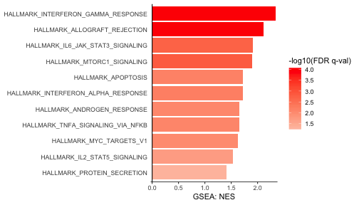
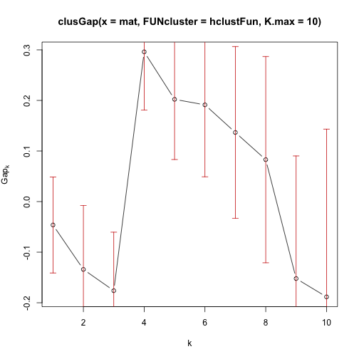
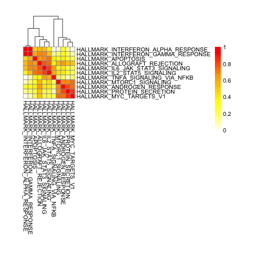
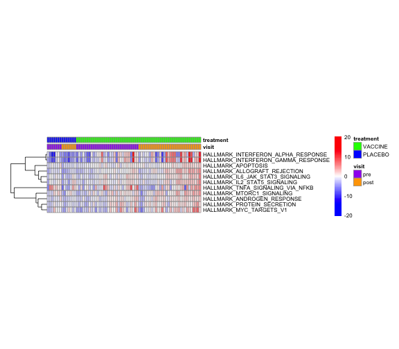

loading require packages

```r
suppressPackageStartupMessages(library(package = "knitr"))
suppressPackageStartupMessages(library(package = "RCurl"))
suppressPackageStartupMessages(library(package = "Biobase"))
suppressPackageStartupMessages(library(package = "ggplot2"))
suppressPackageStartupMessages(library(package = "cluster"))
suppressPackageStartupMessages(library(package = "pheatmap"))
suppressPackageStartupMessages(library(package = "readr"))
suppressPackageStartupMessages(library(package = "dplyr"))
suppressPackageStartupMessages(library(package = "tidyr"))
suppressPackageStartupMessages(library(package = "tibble"))
```

set default options/variables

```r
workDir <- dirname(getwd())
opts_chunk$set(tidy = FALSE, fig.path = "../figure/")
options(stringsAsFactors = FALSE, width = 80)
```

read SLEA ExpressionSet

```r
gsSetRawFile <- file.path(workDir,
                          "output/rv144pilot.gsSetVehSubstracted.RData")
load(file = gsSetRawFile)
```

plot barplot showing normalized enrichment score of enriched genesets

```r
plotDF <- fData(gsSetRaw) %>%
  filter(`FDR q-val` <= 0.05) %>%
  arrange(NES, `FDR q-val`) %>%
  mutate(NAME = factor(NAME, levels = NAME),
         `FDR q-val` = pmax(`FDR q-val`, 1e-04),
         `FDR q-val` = -log10(`FDR q-val`) * sign(NES)) %>%
  select(NAME, NES, `FDR q-val`)
plotBar <- ggplot(data    = plotDF,
                  mapping = aes(x = NAME, y = NES, fill = `FDR q-val`)) +
  geom_bar(stat = "identity") +
  scale_y_continuous(expand = c(0.01, 0)) +
  scale_fill_gradient2(name = "-log10(FDR q-val)",
                       low = "blue", mid = "white", high = "red") +
  labs(x = NULL, y = "GSEA: NES") +
  geom_hline(yintercept = 0) +
  coord_flip() +
  theme_bw() +
  theme(axis.line.x  = element_line(color = "black"),
        axis.line.y  = element_blank(),
        axis.text.y  = element_text(hjust = 1, vjust = 0.5),
        axis.ticks.y = element_blank(),
        panel.border = element_blank(),
        panel.grid   = element_blank())
print(plotBar)
```



determine the number of set of correlated genesets

```r
flag <- pData(gsSetRaw) %>%
  filter(`stimulation time` %in% 15) %>%
  select(donor, visit, `Sample name`) %>%
  spread(visit, `Sample name`) %>%
  filter(complete.cases(.)) %>%
  gather(visit, `Sample name`, -donor)
mat <- exprs(gsSetRaw)[fData(gsSetRaw)$"FDR q-val" <= 0.05,
                       flag$"Sample name"]
hclustFun <- function(X, k) {
  distMat <- as.dist((1-cor(t(X)))/2)
  hc <- hclust(distMat)
  group <- cutree(hc, k)
  return(value = list(cluster = group))
}
set.seed(seed = 111)
fit <- clusGap(mat, hclustFun, K.max = 10)
plot(fit)
```



```r
print(fit, method = "globalSEmax")
```

```
## Clustering Gap statistic ["clusGap"] from call:
## clusGap(x = mat, FUNcluster = hclustFun, K.max = 10)
## B=100 simulated reference sets, k = 1..10; spaceH0="scaledPCA"
##  --> Number of clusters (method 'globalSEmax', SE.factor=1): 4
##           logW   E.logW         gap     SE.sim
##  [1,] 4.332752 4.286456 -0.04629572 0.09489605
##  [2,] 4.113765 3.979655 -0.13411004 0.12651150
##  [3,] 3.903299 3.727155 -0.17614382 0.11567892
##  [4,] 3.208124 3.504154  0.29603045 0.11518557
##  [5,] 3.065703 3.267838  0.20213479 0.11898030
##  [6,] 2.843997 3.035234  0.19123737 0.14227075
##  [7,] 2.606959 2.743604  0.13664472 0.16986437
##  [8,] 2.306303 2.389217  0.08291446 0.20388936
##  [9,] 2.034552 1.882376 -0.15217670 0.24243110
## [10,] 1.294605 1.106186 -0.18841879 0.33161430
```

```r
Kmax <- maxSE(fit$Tab[, "gap"], fit$Tab[, "SE.sim"], method = "globalSEmax")
```

correlation heatmap

```r
corMat <- cor(t(mat))
distMat <- as.dist(1 - corMat)
pheatmap(mat                      = corMat,
         color                    = colorRampPalette(c("white",
                                                       "yellow",
                                                       "orange",
                                                       "red"))(100),
         breaks                   = c(min(corMat),
                                      seq(from = 0,
                                          to = 1,
                                          length.out = 100)),
         cellwidth                = 8,
         cellheight               = 8,
         clustering_distance_rows = distMat,
         clustering_distance_cols = distMat,
         treeheight_row           = 0)
```



heatmap geneset by pathway

```r
colOrder <- apply(mat, 1, rank) %>%
  rowMeans() %>%
  data.frame(meanRank = .) %>%
  rownames_to_column() %>%
  merge(pData(gsSetRaw), by.y = "Sample name", by.x = "rowname") %>%
  arrange(treatment, desc(visit), meanRank)
pheatmap(mat                      = mat[, colOrder$rowname],
         color                    = colorRampPalette(c("blue",
                                                       "white",
                                                       "red"))(100),
         breaks                   = c(-max(abs(mat)),
                                      seq(from       = -1 * min(abs(range(mat))),
                                          to         = min(abs(range(mat))),
                                          length.out = 99),
                                      max(abs(mat))),
         cellwidth                = 3,
         cellheight               = 8,
         fontsize                 = 8,
         cluster_cols             = FALSE,
         clustering_distance_rows = "correlation",
         annotation_col           = pData(gsSetRaw)[, c("visit", "treatment")],
         annotation_color         = list(treatment = c(VACCINE = "green",
                                                       PLACEBO = "blue"),
                                         visit     = c(pre  = "purple",
                                                       post = "orange")),
         show_colnames            = FALSE)
```



print session info

```r
sessionInfo()
```

```
## R version 3.5.1 (2018-07-02)
## Platform: x86_64-apple-darwin17.6.0 (64-bit)
## Running under: macOS High Sierra 10.13.6
## 
## Matrix products: default
## BLAS: /System/Library/Frameworks/Accelerate.framework/Versions/A/Frameworks/vecLib.framework/Versions/A/libBLAS.dylib
## LAPACK: /System/Library/Frameworks/Accelerate.framework/Versions/A/Frameworks/vecLib.framework/Versions/A/libLAPACK.dylib
## 
## locale:
## [1] en_US.UTF-8/en_US.UTF-8/en_US.UTF-8/C/en_US.UTF-8/en_US.UTF-8
## 
## attached base packages:
## [1] parallel  stats     graphics  grDevices utils     datasets  methods  
## [8] base     
## 
## other attached packages:
##  [1] bindrcpp_0.2.2      tibble_1.4.2        tidyr_0.8.1        
##  [4] dplyr_0.7.6         readr_1.1.1         pheatmap_1.0.10    
##  [7] cluster_2.0.7-1     ggplot2_3.0.0       Biobase_2.40.0     
## [10] BiocGenerics_0.26.0 RCurl_1.95-4.11     bitops_1.0-6       
## [13] knitr_1.20         
## 
## loaded via a namespace (and not attached):
##  [1] Rcpp_0.12.18       highr_0.7          pillar_1.3.0       compiler_3.5.1    
##  [5] RColorBrewer_1.1-2 plyr_1.8.4         bindr_0.1.1        tools_3.5.1       
##  [9] digest_0.6.15      evaluate_0.11      gtable_0.2.0       pkgconfig_2.0.1   
## [13] rlang_0.2.1        withr_2.1.2        stringr_1.3.1      hms_0.4.2         
## [17] grid_3.5.1         tidyselect_0.2.4   glue_1.3.0         R6_2.2.2          
## [21] purrr_0.2.5        magrittr_1.5       scales_1.0.0       assertthat_0.2.0  
## [25] colorspace_1.3-2   labeling_0.3       stringi_1.2.4      lazyeval_0.2.1    
## [29] munsell_0.5.0      crayon_1.3.4
```
