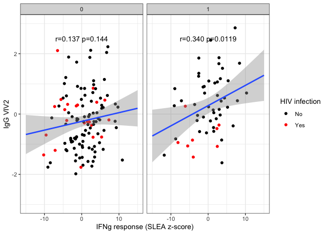
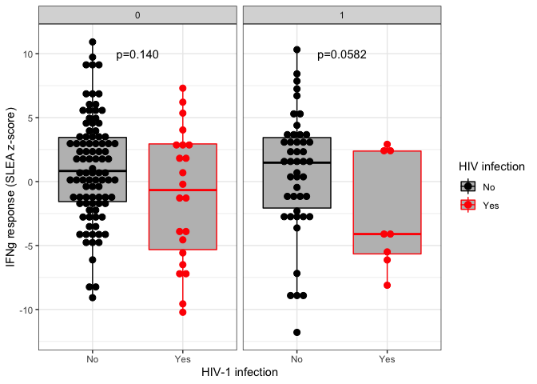
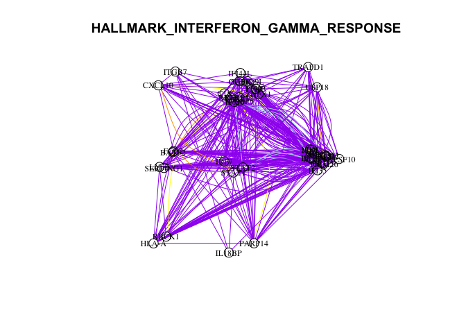

RV144 Fig5abc
================
Slim FOURATI
09/14/2016

``` r
# loading require packages
suppressPackageStartupMessages(library(package = "knitr"))
suppressPackageStartupMessages(library(package = "RCurl"))
suppressPackageStartupMessages(library(package = "Biobase"))
suppressPackageStartupMessages(library(package = "limma"))
suppressPackageStartupMessages(library(package = "pheatmap"))
suppressPackageStartupMessages(library(package = "ggplot2"))
suppressPackageStartupMessages(library(package = "XML"))
suppressPackageStartupMessages(library(package = "igraph"))
suppressPackageStartupMessages(library(package = "dplyr"))
suppressPackageStartupMessages(library(package = "tibble"))
suppressPackageStartupMessages(library(package = "readr"))
suppressPackageStartupMessages(library(package = "tidyr"))
```

``` r
knitr::opts_chunk$set(echo = TRUE) # do not echo chunks
opts_chunk$set(tidy = FALSE, fig.path = "../figure/")
options(dplyr.summarise.inform = FALSE)
workDir <- dirname(getwd())
```

``` r
# read ENV-DMSO ExpressionSet
esetBaselinedFile <- file.path(workDir,
                               "output",
                               "rv144.esetBaselined.RData")
load(file = esetBaselinedFile)
```

load genesets ExpressionSet

``` r
gsSetFile <- file.path(workDir,
                       "output",
                       "rv144.gsSet.RData")
load(file = gsSetFile)
# add donor ID to phenotypic annotation
gsSet$pin <- gsSet$donor
```

Download primary correlates data and haplotype data

``` r
primCorrelatesSetFile <- file.path(workDir,
                                   "output",
                                   "rv144.primCorrelatesSet.RData")
load(file = primCorrelatesSetFile)

haplotypeSetFile <- file.path(workDir,
                              "output",
                              "rv144.haplotypeSet.RData")
load(file = haplotypeSetFile)

# ics
icsFile <- file.path(workDir,
                     "output",
                     "rv144.icsSet.RData")
load(file = icsFile)

# merge ExpressionSet and primary correlates data
primCorrelatesDF <- exprs(primCorrelatesSet) %>%
  t() %>%
  as.data.frame() %>%
  rownames_to_column()
haplotypeDF <- exprs(haplotypeSet) %>%
  t() %>%
  as.data.frame() %>%
  rownames_to_column()
icsDF <- exprs(icsSet) %>%
  t() %>%
  as.data.frame() %>%
  rownames_to_column()

pdata <- pData(esetBaselined) %>%
  merge(primCorrelatesDF, by.x = "donor", by.y = "rowname", all.x = TRUE) %>%
  merge(y = haplotypeDF, by.x = "donor", by.y = "rowname", all.x = TRUE) %>%
  merge(y = icsDF, by.x = "donor", by.y = "rowname", all.x = TRUE)
rownames(pdata) <- pdata$"Sample name"
pData(esetBaselined) <- pdata[sampleNames(esetBaselined), ]

pData(gsSet) <- pData(esetBaselined)
```

``` r
plotDF <- exprs(gsSet) %>%
  as.data.frame() %>%
  rownames_to_column() %>%
  gather(`Sample name`, value, -rowname) %>%
  merge(pData(gsSet), by = "Sample name") %>%
  filter(treatment %in% "VACCINE" & !is.na(DPB13) &
         rowname %in% "HALLMARK_INTERFERON_GAMMA_RESPONSE") %>%
  mutate(DPB13 = factor(DPB13))
statDF <- data.frame(value = c(0, 0),
                     primary_v2_gp70_v1v2_zollapazner_wk26 = c(2.5, 2.5),
                     label = c("r=0.137 p=0.144", "r=0.340 p=0.0119"),
                     DPB13 = c(0, 1),
                     check.names = FALSE)

ggplot(data = filter(plotDF, !is.na(DPB13)),
       mapping = aes(x = value, primary_v2_gp70_v1v2_zollapazner_wk26)) +
  geom_point(mapping = aes(color = `HIV infection`)) +
  scale_color_manual(values = c(No = "black", Yes = "red")) +
  scale_x_continuous(limit = c(-15, 15)) +
  scale_y_continuous(limit = c(-3, 3)) +
  geom_smooth(method = "lm", fullrange = TRUE) +
  facet_wrap(facet = ~DPB13) +
    geom_text(data = statDF, mapping = aes(label = label)) +
    labs(x = "IFNg response (SLEA z-score)", y = "IgG VIV2") +
  theme_bw()
```

    ## `geom_smooth()` using formula 'y ~ x'

<!-- -->

``` r
statDF <- data.frame(`HIV infection` = c(1.5, 1.5),
                     value = c(10, 10),
                     label = c("p=0.140", "p=0.0582"),
                     DPB13 = c(0, 1),
                     check.names = FALSE)
ggplot(data = filter(plotDF, !is.na(DPB13)),
       mapping = aes(x = `HIV infection`, y = value)) +
  geom_boxplot(outlier.colour = "transparent", fill = "grey",
               mapping = aes(color = `HIV infection`)) +
  geom_dotplot(binaxis = "y", binwidth = 0.5, stackdir = "center",
               mapping = aes(color = `HIV infection`, fill = `HIV infection`)) +
    scale_color_manual(values = c(No = "black", Yes = "red")) +
   scale_fill_manual(values = c(No = "black", Yes = "red")) +
  facet_wrap(facet = ~DPB13) +
  geom_text(data = statDF, mapping = aes(label = label)) +
  labs(y = "IFNg response (SLEA z-score)", x = "HIV-1 infection") +
  theme_bw()
```

<!-- -->

``` r
#plotDF %>%
#  group_by(DPB13) %>%
#  do(r = cor.test(formula = ~ value + primary_v2_gp70_v1v2_zollapazner_wk26,
#         data = .,
#         method = "pearson")$estimate,
#     p = cor.test(formula = ~ value + primary_v2_gp70_v1v2_zollapazner_wk26,
#         data = .,
#         method = "pearson")$p.value) %>%
#  mutate(r = unlist(r),
#         p = unlist(p))

# plotDF %>%
#  group_by(DPB13) %>%
#  do(p = wilcox.test(formula = value ~ `HIV infection`, data = .)$p.value) %>%
#  mutate(p = unlist(p))
```

download GSEA JAR file and hallmark GMT

``` r
# download GSEA JAR application from the BROAD web site
gseaPath <-
  file.path("http://fouslim.bitbucket.org/RV144.ReportOct5/geneset_analysis",
            "gsea2-2.2.1.jar")
gseaJar <- basename(gseaPath)
gseaBin <- getBinaryURL(url = gseaPath, followlocation = TRUE)
gseaCon <- file(gseaJar, open = "wb")
writeBin(gseaBin, gseaCon)
close(con = gseaCon)

# downaload hallmark in GMT file from the MSigDB web site
gmtFile <- "/Users/sxf279/Desktop/Projects/Utils/GSEA/h.all.v5.1.symbols.gmt"
file.copy(from = gmtFile, to = ".")
gmtFile <- basename(gmtPath)
```

differential expression analysis: antibody response

``` r
fits <- list()
# difference between DPB13 haplotypes
flag <- esetBaselined$treatment %in% "VACCINE" &
  !is.na(esetBaselined$DPB13)
esetTemp <- esetBaselined[, flag]
dpb13 <- factor(esetTemp$DPB13)
design <- model.matrix(~dpb13)
rownames(design) <- sampleNames(esetTemp)
fit <- lmFit(esetTemp, design = design)
fit2 <- eBayes(fit = fit)
fits[["dpb13"]] <- list(fit = fit, fit2 = fit2)

# correlation with PFS
flag <- esetBaselined$treatment %in% "VACCINE" &
  !is.na(esetBaselined$COMPASSPolyfunctionalityScore)
esetTemp <- esetBaselined[, flag]
pfs <- esetTemp$COMPASSPolyfunctionalityScore
design <- model.matrix(~pfs)
rownames(design) <- sampleNames(esetTemp)
fit <- lmFit(esetTemp, design = design)
fit2 <- eBayes(fit = fit)
fits[["pfs"]] <- list(fit = fit, fit2 = fit2)

# correlation with igg
flag <- esetBaselined$treatment %in% "VACCINE" &
  !is.na(esetBaselined$primary_v2_gp70_v1v2_zollapazner_wk26)
esetTemp <- esetBaselined[, flag]
igg <- esetTemp$primary_v2_gp70_v1v2_zollapazner_wk26
design <- model.matrix(~igg)
rownames(design) <- sampleNames(esetTemp)
fit <- lmFit(esetTemp, design = design)
fit2 <- eBayes(fit = fit)
fits[["igg"]] <- list(fit = fit, fit2 = fit2)

# correlation w/ igg among HLA-DPB13*1
flag <- esetBaselined$treatment %in% "VACCINE" &
  !is.na(esetBaselined$primary_v2_gp70_v1v2_zollapazner_wk26) &
  esetBaselined$DPB13 %in% 1
esetTemp <- esetBaselined[, flag]
igg <- esetTemp$primary_v2_gp70_v1v2_zollapazner_wk26
design <- model.matrix(~igg)
rownames(design) <- sampleNames(esetTemp)
fit <- lmFit(esetTemp, design = design)
fit2 <- eBayes(fit = fit)
fits[["dpb13_1_igg"]] <- list(fit = fit, fit2 = fit2)

# correlation w/ igg among HLA-DPB13*0
flag <- esetBaselined$treatment %in% "VACCINE" &
  !is.na(esetBaselined$primary_v2_gp70_v1v2_zollapazner_wk26) &
  esetBaselined$DPB13 %in% 0
esetTemp <- esetBaselined[, flag]
igg <- esetTemp$primary_v2_gp70_v1v2_zollapazner_wk26
design <- model.matrix(~igg)
rownames(design) <- sampleNames(esetTemp)
fit <- lmFit(esetTemp, design = design)
fit2 <- eBayes(fit = fit)
fits[["dpb13_0_igg"]] <- list(fit = fit, fit2 = fit2)

# challenge
esetTemp <- esetBaselined
trtcase <- interaction(esetTemp$treatment, esetTemp$"HIV infection")
design <- model.matrix(~0 + trtcase)
colnames(design) <- gsub(pattern = "trtcase", replacement = "", colnames(design))
rownames(design) <- sampleNames(esetTemp)
fit <- lmFit(esetTemp, design = design)
contrastMat <- makeContrasts(contrasts = "VACCINE.No-VACCINE.Yes",
                             levels = fit$design)
fit2 <- contrasts.fit(fit, contrastMat)
fit2 <- eBayes(fit = fit2)
fits[["infection"]] <- list(fit = fit, fit2 = fit2)

# save
save(fits, file = "rv144.fig4.fits.RData")
```

create ranked list file

``` r
# extract MArrayLM object
rnkList <- lapply(names(fits), FUN = function(modelName) {
  # print(modelName)
  fit2 <- fits[[modelName]][["fit2"]]
  sortBy <- "t"
  coefName <- setdiff(colnames(fit2), "(Intercept)")
  top <- topTable(fit      = fit2,
                  coef     = coefName,
                  number   = Inf,
                  genelist = fit2$genes[, c("IlmnID", "SYMBOL"), drop = FALSE],
                  sort.by  = sortBy)
  # split ambiguous mapping (probe annotated to multiple genes)
  geneLS <- strsplit(top$SYMBOL, split = " /// ")
  names(geneLS) <- 1:length(geneLS)
  geneMap <- stack(geneLS)
  geneMap$ind <- as.numeric(as.vector(geneMap$ind))
  top <- top[geneMap$ind, ]
  top$SYMBOL <- geneMap$values
  # select the probe with the largest variance as representative of a gene
  top <- top[order(fit2$sigma[match(top$IlmnID, table = fit2$genes$IlmnID)],
                   decreasing = TRUE), ]
  uniqGeneList <- setdiff(top$SYMBOL, "---")
  top <- top[match(uniqGeneList, table = top$SYMBOL), ]
  top <- top[, c("SYMBOL", sortBy)]
  rnkFile <- paste0("gsea_", modelName, "_", coefName, ".rnk")
  rnkFile <- make.names(rnkFile)
  write(paste(c("#", colnames(top)), collapse = " "), file = rnkFile)
  write_tsv(top, path = rnkFile)
  return(value = c(modelName   = modelName,
                   coefficient = coefName,
                   rnk         = rnkFile))
})
rnkList <- do.call(what = rbind, args = rnkList) %>%
  as.data.frame()
```

create GSEA parameters file

``` r
gseaParam <- "GSEAPrerankedParameters.txt"
gseaParamMat <- as.data.frame(c(collapse             = "false",
                                nperm                = "1000",
                                scoring_scheme       = "weighted",
                                include_only_symbols = "true",
                                make_sets            = "true",
                                plot_top_x           = 5,
                                rnd_seed             = 101,
                                set_max              = 500,
                                set_min              = 15,
                                zip_report           = "false",
                                gui                  = "false")) %>%
  rownames_to_column()
write_tsv(gseaParamMat, path= gseaParam, col_names = FALSE)
```

run preranked GSEA

``` r
# result will be written in directory called advanced
gseaDir <- "advanced"
if (!file.exists(gseaDir)) {
  flag <- dir.create(path = gseaDir)
  if (!flag) {
    errorMessage <- paste("unable to create", gseaDir)
    stop(erroMessage)
  }
}

# generate GSEA command line call
gseaJava <- "java -Xmx2G -cp"
gmtFile <- "h.all.v5.1.symbols.gmt"
gseaIndex <- lapply(rnkList[, "rnk"], FUN = function(gseaRnk) {
  logFileName <- gsub(pattern = "rnk$", replacement = "log", gseaRnk)
  gseaRpt <- basename(c(gseaRnk, gmtFile))
  gseaRpt <- gsub(pattern = "[.].+$", replacement = "", gseaRpt)
  gseaRpt <- paste(gseaRpt, collapse = ".")
  gseaCall <- paste(gseaJava,
                    gseaJar,
                    "xtools.gsea.GseaPreranked -param_file",
                    gseaParam,
                    "-rnk",
                    gseaRnk,
                    "-gmx",
                    gmtFile,
                    "-rpt_label",
                    gseaRpt,
                    "-out",
                    gseaDir,
                    ">",
                    logFileName)
  gseaIntern <- system(command       = gseaCall,
                       intern        = TRUE,
                       ignore.stderr = TRUE)
  if (!is.null(attr(gseaIntern, which = "status"))) {
    errorMessage <- paste("gsea stoped unexpectedly, refer to",
                          logFileName,
                          "for further details")
    stop(errorMessage)
  }
  return(value = c(rnk = gseaRnk, rpt = file.path(gseaDir, gseaRpt)))
})
gseaIndex <- do.call(what = rbind, args = gseaIndex)
gseaIndex <- merge(rnkList, gseaIndex, by = "rnk")
```

remove previous gsea run from the advanced directory

``` r
dirList <- list.dirs("advanced", recursive = FALSE)
dirList <- rev(dirList)
tag <- gsub(pattern = ".[0-9]+$", replacement = "", dirList)
ids <- match(unique(tag), table = tag)
ids <- setdiff(1:length(tag), ids)
flag <- unlink(x = dirList[ids], recursive = TRUE)
flag <- all(flag %in% 0)
dirLS <- list.dirs(path = "advanced", recursive = FALSE)
dirLS <- cbind(directory = dirLS,
               rpt       = gsub(pattern = ".GseaPreranked.+$",
                   replacement = "",
                   dirLS))
gseaIndex <- merge(gseaIndex, dirLS, by = "rpt")
```

delete temporary directory create during gsea run

``` r
dirName <- tolower(format(Sys.Date(), "%b%d"))
flag <- file.remove(dirName)
```

read gsea output directories

``` r
gseaOutput <- apply(gseaIndex, MARGIN = 1, FUN = function(gseaRun) {
  gseaDir <- gseaRun[["directory"]]
  # read rpt file in gsea output directory
  rptFile <- list.files(path = gseaDir, pattern = "rpt", full.names = TRUE)
  rpt <- read_tsv(file      = rptFile,
                  col_names = c("type", "name", "value"))
  # read gmt file
  gmxFile <- rpt$value[rpt$name %in% "gmx"]
  gmx <- read_tsv(file = gmxFile, col_names = FALSE)
  # remove geneset name and description column
  gsNames <- gmx$X1
  gmx <- apply(select(gmx, -(1:2)), MARGIN = 1, FUN = function(x) {
    return(value = setdiff(unname(x), NA))
  })
  names(gmx) <- gsNames
  # read result files
  resFile <- grep(pattern = "gsea_report.*xls",
                  dir(path = gseaDir, full.names = TRUE),
                  value   = TRUE)
  resOut <- lapply(resFile, FUN = function(fileName) {
    resTable <- read_tsv(file = fileName)
  })
  resOut <- do.call(what = rbind, args = resOut)
  # extract leading edge genes
  rnk <- read_tsv(file      = gseaRun[["rnk"]],
                  skip      = 1,
                  col_names = c("SYMBOL", "t")) %>%
                    arrange(desc(t))
  leGenes <- group_by(resOut, NAME) %>%
    do(LEADING_EDGE = ifelse(test = sign(.$NES) %in% 1,
           yes = paste(intersect(rnk$SYMBOL[seq(from = 1,
               to = .$"RANK AT MAX" + 1)],
               gmx[[.$NAME]]), collapse = ","),
           no  = paste(intersect(rnk$SYMBOL[seq(from = nrow(rnk) -
               .$"RANK AT MAX",
               to = nrow(rnk))],
               gmx[[.$NAME]]), collapse = ","))) %>%
    ungroup() %>%
    mutate(LEADING_EDGE = unlist(LEADING_EDGE))
  resOut <- merge(resOut, leGenes, by = "NAME")
  # append directory name
  resOut <- mutate(resOut, directory = gseaDir)
  return(value = resOut)
})
gseaOutput <- do.call(what = rbind, args = gseaOutput)
gseaOutput <- merge(gseaOutput, gseaIndex, by = "directory")
# save
save(gseaOutput, file = "rv144.fig4.gseaOutput.RData")
```

``` r
# download genemani JAR file
genemaniaPath <- file.path(workDir, "utils",
                           "plugin-cy3-3.4.1.jar")
genemaniaFile <- basename(genemaniaPath)
file.copy(from = genemaniaPath, to = ".")
# identify most recent genemania database                                              
genemaniaJava <- "java -Xmx1G -jar"
genemaniaCmd <- "DataAdmin list"
genemaniaCall <- paste(genemaniaJava, genemaniaFile, genemaniaCmd)
genemaniaIntern <- system(command       = genemaniaCall,
                          intern        = TRUE,
                          ignore.stderr = TRUE)
genemaniaOutput <- genemaniaIntern %>%
  strsplit(split = "\t") %>%
  do.call(what = rbind)
colnames(genemaniaOutput) <- genemaniaOutput[1, ]
genemaniaDB <- genemaniaOutput %>%
  as.data.frame() %>%
  filter(grepl(pattern = "core", `Data Set ID`)) %>%
  arrange(desc(`Data Set ID`)) %>%
  .[1, "Data Set ID"]
# download genemania database                                                          
genemaniaCmd <- "DataAdmin install"
genemaniaCall <- paste(genemaniaJava, genemaniaFile, genemaniaCmd, genemaniaDB)
genemaniaIntern <- system(command       = genemaniaCall,
                          intern        = TRUE,
                          ignore.stderr = TRUE)
genemaniaDB <- paste0("gmdata-", genemaniaDB)
genemaniaCmd <- "DataAdmin list-data"
genemaniaCall <- paste(genemaniaJava, genemaniaFile, genemaniaCmd, genemaniaDB)
genemaniaIntern <- system(command       = genemaniaCall,
                          intern        = TRUE,
                          ignore.stderr = TRUE)
genemaniaOutput <- genemaniaIntern %>%
  gsub(pattern = "\t$", replacement = "\t ") %>%
  strsplit(split = "\t") %>%
  do.call(what = rbind)
colnames(genemaniaOutput) <- genemaniaOutput[1, ]
genemaniaID <- genemaniaOutput %>%
  as.data.frame() %>%
  filter(grepl(pattern = "Human", Description)) %>%
  .$"Data ID"
genemaniaCmd <- "DataAdmin install-data"
genemaniaCall <- paste(genemaniaJava,
                       genemaniaFile,
                       genemaniaCmd,
                       genemaniaDB,
                       genemaniaID)
genemaniaIntern <- system(command       = genemaniaCall,
                          intern        = TRUE,
                          ignore.stderr = TRUE)
```

``` r
sigDF <- gseaOutput %>%
  filter(NAME %in% "HALLMARK_INTERFERON_GAMMA_RESPONSE" &
         modelName %in% c("dpb13_1_igg", "infection"))
colorLS <- colorRampPalette(c("blue", "white", "red"))(n = 100)
esetTemp <- esetBaselined[, esetBaselined$treatment %in% "VACCINE"]
geneSigma <- apply(exprs(esetTemp), MARGIN = 1, FUN = var) %>%
  data.frame(sigma = .) %>%
  rownames_to_column()
geneLS <- fData(esetTemp)$SYMBOL %>%
  strsplit(split = " /// ")
names(geneLS) <- fData(esetTemp)$IlmnID
geneLS <- stack(geneLS) %>%
  mutate(ind = as.vector(ind))
geneLS <- merge(geneLS, geneSigma, by.x = "ind", by.y = "rowname") %>%
  arrange(desc(sigma)) %>%
  filter(!duplicated(values))

gs <- sigDF$LEADING_EDGE %>%
  strsplit(split = ",") %>%
  unlist() %>%
  .[duplicated(.)]

# prepare input file                                                                   
genemaniaParamsPath <- file.path(workDir, "input",
                                 "genemania-parameters.csv")
genemaniaDefault <- scan(file = genemaniaParamsPath, what = "raw", sep = "\n")

genemaniaJava <- "java -Xmx1G -jar"
genemaniaJar <- list.files(pattern = "plugin.+jar")
genemaniaCmd <- "QueryRunner"
genemaniaDB <- list.files(pattern = "gmdata", include.dirs = TRUE)
genemaniaDir <- "advanced"
queryFile <- "genemania_genesig.query"
logFileName <- gsub(pattern = ".query", replacement = ".log", queryFile)
relatedGeneLimit <- 0

gsName <- "HALLMARK_INTERFERON_GAMMA_RESPONSE"
write("H. Sapiens", file = queryFile)
write(paste(gs, collapse = "\t"), file = queryFile, append = TRUE)
write("default", file = queryFile, append = TRUE)
write(relatedGeneLimit, file = queryFile, append = TRUE)
write("average", file = queryFile, append = TRUE)

genemaniaCall <- paste(genemaniaJava,
                       genemaniaJar,
                       genemaniaCmd,
                       queryFile,
                       "--data", genemaniaDB,
                       "--out xml",
                       "--results",
                       genemaniaDir,
                       ">",
                       logFileName)
genemaniaIntern <- system(command       = genemaniaCall,
                          intern        = TRUE,
                          ignore.stderr = TRUE)
```

draw interferon gamma network

``` r
# plot network
gsName <- "HALLMARK_INTERFERON_GAMMA_RESPONSE"
queryFile <- "genemania_genesig.query"
outputFile <- paste0(queryFile, "-results.report.xml")
outputFile <- file.path(workDir, "output", basename(outputFile))
textXML <- xmlRoot(xmlTreeParse(file = outputFile))
textDF <- xmlChildren(textXML[["results"]][["interactions"]]) %>%
    lapply(FUN = xmlAttrs) %>%
    do.call(what = rbind) %>%
    as.data.frame(row.names = as.character(1:nrow(.))) %>%
    mutate(weight = as.numeric(weight))

symbol <- union(textDF$from, textDF$to)
edgesDF <- textDF %>%
    select(from, to, type) %>%
    distinct() %>%
    mutate(color = c("Co-expression"          = "purple",
                     "Shared protein domains" = "yellow",
                     "Genetic interactions"   = "darkblue",
                     Predicted                = "orange",
                     Pathway                  = "lightblue",
                     "Physical interactions"  = "red")[type])

g <- graph.empty(directed = FALSE) %>%
    add.vertices(nv = length(symbol), name = symbol, color = NA) %>%
    add.edges(edges  = t(edgesDF[, c("from", "to")]),
              weight = edgesDF$weight,
              type   = edgesDF$type,
              color  = edgesDF$color)

# layout based on genes annotations
fig5aAnnotPath <- file.path(workDir, "input", "Fig5a.annot.csv")
fig5aAnnot <- read_csv(file = fig5aAnnotPath)
```

    ## New names:
    ## * `` -> ...7

    ## Warning: One or more parsing issues, see `problems()` for details

    ## Rows: 38 Columns: 7

    ## ── Column specification ────────────────────────────────────────────────────────
    ## Delimiter: ","
    ## chr (6): NAME, SYMBOL, Description, Function, Group, PMID
    ## lgl (1): ...7

    ## 
    ## ℹ Use `spec()` to retrieve the full column specification for this data.
    ## ℹ Specify the column types or set `show_col_types = FALSE` to quiet this message.

``` r
fig5aAnnot <- fig5aAnnot %>%
    mutate(Group = gsub(pattern = "([^\\/]+) \\/.+$", replacement = "\\1", Group),
           Group = ifelse(test = is.na(Group), yes = "Other", no = Group))

group2Pos <- data.frame(Group = c("Signal transduction",
                                  "Cell trafficking",
                                  "Immuno-suppressor",
                                  "Antigen presentation",
                                  "Other",
                                  "Antiviral",
                                  "Th development",
                                  "Inhibitor of NF-kB signaling"),
                        x     = c(0, -1, -1, -1, 0, 1, 0, 1),
                        y     = c(0, 1, 0, -1, 1, 0, -1, 1))
layoutDF <- fig5aAnnot %>%
    select(SYMBOL, Group) %>%
    merge(group2Pos, by = "Group")
layoutMat <- layoutDF[match(V(g)$name, table = layoutDF$SYMBOL), c("x", "y")] %>%
    as.matrix()
layoutMat <- layoutMat + rnorm(prod(dim(layoutMat)), mean = 0, sd = 0.1)
plot.igraph(g,
            vertex.size        = 10,
            vertex.label.color = "black",
            vertex.frame.color = "black",
            vertex.label.font  = 1,
            vertex.label.cex   = 0.75,
            layout             = layoutMat,
            main               = gsName)
```

<!-- -->

print session info

``` r
sessionInfo()
```

    ## R version 4.1.2 (2021-11-01)
    ## Platform: x86_64-apple-darwin20.6.0 (64-bit)
    ## Running under: macOS Big Sur 11.6
    ## 
    ## Matrix products: default
    ## BLAS:   /usr/local/Cellar/openblas/0.3.18/lib/libopenblasp-r0.3.18.dylib
    ## LAPACK: /usr/local/Cellar/r/4.1.2/lib/R/lib/libRlapack.dylib
    ## 
    ## locale:
    ## [1] en_US.UTF-8/en_US.UTF-8/en_US.UTF-8/C/en_US.UTF-8/en_US.UTF-8
    ## 
    ## attached base packages:
    ## [1] parallel  stats     graphics  grDevices utils     datasets  methods  
    ## [8] base     
    ## 
    ## other attached packages:
    ##  [1] tidyr_1.1.4         readr_2.1.1         tibble_3.1.6       
    ##  [4] dplyr_1.0.7         igraph_1.2.10       XML_3.99-0.8       
    ##  [7] ggplot2_3.3.5       pheatmap_1.0.12     limma_3.48.3       
    ## [10] Biobase_2.52.0      BiocGenerics_0.38.0 RCurl_1.98-1.5     
    ## [13] knitr_1.37         
    ## 
    ## loaded via a namespace (and not attached):
    ##  [1] tidyselect_1.1.1   xfun_0.29          purrr_0.3.4        splines_4.1.2     
    ##  [5] lattice_0.20-45    colorspace_2.0-2   vctrs_0.3.8        generics_0.1.1    
    ##  [9] htmltools_0.5.2    yaml_2.2.1         mgcv_1.8-38        utf8_1.2.2        
    ## [13] rlang_0.4.12       pillar_1.6.4       glue_1.6.0         withr_2.4.3       
    ## [17] DBI_1.1.1          bit64_4.0.5        RColorBrewer_1.1-2 lifecycle_1.0.1   
    ## [21] stringr_1.4.0      munsell_0.5.0      gtable_0.3.0       evaluate_0.14     
    ## [25] labeling_0.4.2     tzdb_0.2.0         fastmap_1.1.0      fansi_1.0.0       
    ## [29] highr_0.9          scales_1.1.1       vroom_1.5.7        bit_4.0.4         
    ## [33] farver_2.1.0       hms_1.1.1          digest_0.6.29      stringi_1.7.6     
    ## [37] grid_4.1.2         cli_3.1.0          tools_4.1.2        bitops_1.0-7      
    ## [41] magrittr_2.0.1     crayon_1.4.2       pkgconfig_2.0.3    ellipsis_0.3.2    
    ## [45] Matrix_1.4-0       rstudioapi_0.13    assertthat_0.2.1   rmarkdown_2.11    
    ## [49] R6_2.5.1           nlme_3.1-153       compiler_4.1.2

\\end{document}
