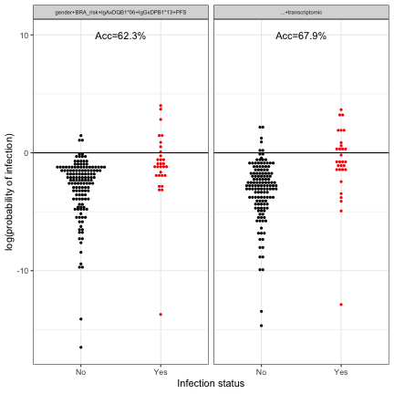
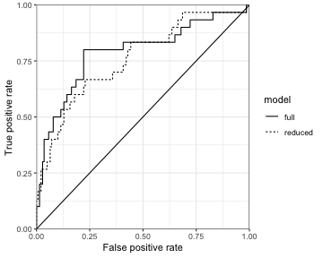

loading require packages

```r
suppressPackageStartupMessages(library(package = "knitr"))
suppressPackageStartupMessages(library(package = "Biobase"))
suppressPackageStartupMessages(library(package = "limma"))
suppressPackageStartupMessages(library(package = "readr"))
suppressPackageStartupMessages(library(package = "ggplot2"))
suppressPackageStartupMessages(library(package = "dplyr"))
suppressPackageStartupMessages(library(package = "ROCR"))
suppressPackageStartupMessages(library(package = "pROC"))
suppressPackageStartupMessages(library(package = "tibble"))
suppressPackageStartupMessages(library(package = "tidyr"))
```

set default options/variables

```r
workDir <- dirname(getwd())
opts_chunk$set(tidy = FALSE, fig.path = "../figure/")
options(stringsAsFactors  = FALSE,
        width             = 80,
        readr.num_columns = 0)
```

load genesets ExpressionSet

```r
gsSetFile <- file.path(workDir, "output/rv144.gsSet.RData")
load(file = gsSetFile)
gsSet$pin <- gsSet$donor
```

read clinical annotation

```r
clinicalAnnotFile <- file.path(workDir, "input/rv144.master_wk26.csv")
clinicalAnnotation <- read_csv(file      = clinicalAnnotFile,
                               col_types = paste(rep("c", times = 21),
                                                 collapse = ""))
clinicalAnnotation <- lapply(clinicalAnnotation,
                             FUN   = type.convert,
                             as.is = TRUE) %>%
                      data.frame(check.names = FALSE)
# remove unused columns
clinicalAnnotation <- clinicalAnnotation %>%
  select(-v7, -v9)
rownames(clinicalAnnotation) <- clinicalAnnotation$pin
```

read primary correlates ExpressionSet

```r
primCorrelatesFile <- file.path(workDir,
				"output/rv144.primCorrelatesSet.RData")
load(file = primCorrelatesFile)
```

read intracellular cytokine staining ExpressionSet

```r
icsFile <- file.path(workDir, "output/rv144.icsSet.RData")
load(file = icsFile)
```

read haplotype ExpressionSet

```r
haplotypeFile <- file.path(workDir,
                           "output/rv144.haplotypeSet.RData")
load(file = haplotypeFile)
```


```r
allMat <- keyClass <- NULL
for (omic in ls(pattern = "Set$")) {
  # print(omic)
  eval(parse(text = paste("eset <-", omic)))
  allMat <- rbind(allMat,
                  exprs(eset)[,
                              match(clinicalAnnotation$pin,
                                    table = eset$pin),
                              drop = FALSE])
  keyClass <- c(keyClass,
               rep(gsub(pattern = "Set$", replacement = "", omic),
                   times = nrow(eset)))
}
clinicalAnnotation <- cbind(clinicalAnnotation, t(allMat)) %>%
  select(pin, dem_sex, BRA_risk,
         primary_iga_score_tomaras_wk26, primary_v2_gp70_v1v2_zollapazner_wk26,
         COMPASSPolyfunctionalityScore,
         DQB06, DPB13)
pdata <- merge(pData(gsSet),
               clinicalAnnotation,
               by.x = "donor", by.y = "pin", all.x = TRUE) %>%
  mutate(`HIV infection` = factor(`HIV infection`, levels = c("Yes", "No")))
rownames(pdata) <- sampleNames(gsSet)
pData(gsSet) <- pdata
# filter esetBaselined on vaccinated participants
gsSet <- gsSet[, gsSet$treatment %in% "VACCINE" &
               !is.na(gsSet$DQB06) &
               !is.na(gsSet$DPB13)]
```

merge all datasets

```r
# merge all datasets
mergedDF <- cbind(t(exprs(gsSet)), pData(gsSet)) %>%
  dplyr::rename(iga = primary_iga_score_tomaras_wk26,
                igg = primary_v2_gp70_v1v2_zollapazner_wk26,
                pfs = COMPASSPolyfunctionalityScore) %>%
  mutate(infect   = factor(`HIV infection`, levels = c("No", "Yes")),
         BRA_risk = factor(BRA_risk, levels = c("Low", "Medium", "High")))
gsNames <- c("HALLMARK_INTERFERON_GAMMA_RESPONSE",
             "HALLMARK_MTORC1_SIGNALING",
             "HALLMARK_TNFA_SIGNALING_VIA_NFKB")
```

create iteration of the 10-fold cross-validation

```r
cv10LS <- split(1:ncol(gsSet), f = gsSet$"HIV infection") %>%
  lapply(FUN =  function(x) {
    set.seed(seed = 1)
    f <- rep(1:10, times = ceiling(length(x)/10))
    f <- f[1:length(x)]
    return(value = split(sample(x), f = f))
  }) %>%
  do.call(what = c) %>%
  stack() %>%
  mutate(ind = gsub(pattern     = ".+\\.([0-9]+)",
             replacement = "\\1",
             ind)) %>%
  unstack()
```

build logistic regression models and  calculate accuracies

```r
# 10-fold cross validation for the reduced model (all previous correlates of
# protection, minus transcriptomic data)
reducedModelVars <- c("iga", "dem_sex", "BRA_risk", "igg", "pfs", "DQB06",
                      "DPB13")
logitRed <- NULL
for (i in 1:length(cv10LS)) {
  trainDF <- mergedDF[-cv10LS[[i]], c(reducedModelVars, "infect")]
  fit0 <- glm(formula = infect ~ dem_sex + BRA_risk + pfs + iga * DQB06 +
                        igg * DPB13,
              data = trainDF, family = binomial())
  logitRed <- c(logitRed,
                predict(fit0, newdata = mergedDF[cv10LS[[i]], , drop = FALSE]))
}
logitRed <- logitRed[order(as.numeric(names(logitRed)))]
# 10-fold cross validation for the reduced model (only transcriptomic data)
minVars <- c("dem_sex", "BRA_risk", gsNames)
logitMin <- NULL
for (i in 1:length(cv10LS)) {
  trainDF <- mergedDF[-cv10LS[[i]], c(reducedModelVars, "infect")]
  fit0 <- glm(formula = infect ~ ., data = trainDF, family = binomial())
  logitMin <- c(logitMin,
                predict(fit0, newdata = mergedDF[cv10LS[[i]], , drop = FALSE]))
}
logitMin <- logitMin[order(as.numeric(names(logitMin)))]
# 10-fold cross validation for the full  model (all previous correlates of
# protection, plus transcriptomic data)
logitFull <- NULL
for (i in 1:length(cv10LS)) {
  trainDF <- mergedDF[-cv10LS[[i]], c(reducedModelVars, gsNames, "infect")]
  fit <- glm(formula = infect ~ dem_sex + BRA_risk + pfs + iga * DQB06 +
             igg * DPB13 +
             HALLMARK_INTERFERON_GAMMA_RESPONSE +
             HALLMARK_MTORC1_SIGNALING +
             HALLMARK_TNFA_SIGNALING_VIA_NFKB,
             data = trainDF, family = binomial())
  logitFull <- c(logitFull,
                 predict(fit, newdata = mergedDF[cv10LS[[i]], , drop = FALSE]))
}
logitFull <- logitFull[order(as.numeric(names(logitFull)))]
```

jitter plot with prediction of the logistic regression models as a function of
the real status

```r
plotDF <- data.frame(logpp  = c(logitRed, logitFull),
                     infect = rep(mergedDF$infect, times = 2),
                     model  = rep(c("gender+BRA_risk+IgAxDQB1*06+IgGxDPB1*13+PFS",
                         "...+transcriptomic"),
                         each = nrow(mergedDF))) %>%
  mutate(model = factor(model,
             levels = c("gender+BRA_risk+IgAxDQB1*06+IgGxDPB1*13+PFS",
                 "...+transcriptomic")))
# print accuracies of each models
accDF <- plotDF %>%
  filter(!is.na(logpp)) %>%
  group_by(model) %>%
  do(sen = sum(.$logpp > 0 & .$infect %in% "Yes")/sum(.$infect %in% "Yes"),
     spe = sum(.$logpp < 0 & .$infect %in% "No")/sum(.$infect %in% "No")) %>%
  mutate(sen = unlist(sen), spe = unlist(spe), acc = (sen+spe)/2)
accDF %>%
  print()
```

```
## Source: local data frame [2 x 4]
## Groups: <by row>
## 
## # A tibble: 2 x 4
##   model                                         sen   spe   acc
##   <fct>                                       <dbl> <dbl> <dbl>
## 1 gender+BRA_risk+IgAxDQB1*06+IgGxDPB1*13+PFS 0.267 0.979 0.623
## 2 ...+transcriptomic                          0.4   0.957 0.679
```

```r
plotLabels <- data.frame(infect = c(1.5, 1.5),
                         logpp = c(10, 10),
                         model = levels(plotDF$model),
                         label = paste0("Acc=",
                             signif(accDF$acc, digits = 3) * 100,
                             "%")) %>%
  mutate(model = factor(model,
             levels = c("gender+BRA_risk+IgAxDQB1*06+IgGxDPB1*13+PFS",
                 "...+transcriptomic")))
plotJit <- ggplot(data    = plotDF,
                  mapping = aes(x = infect, y = logpp)) +
  geom_dotplot(binaxis = "y", binwidth = 0.25, stackdir = "center",
               color = "transparent", mapping = aes(fill = infect)) +
  geom_hline(yintercept = 0) +
  geom_text(data = plotLabels, mapping = aes(label = label)) +
  labs(x = "Infection status",
       y = "log(probability of infection)") +
  scale_fill_manual(values = c(Yes = "red", No = "black")) +
  facet_wrap(facets = ~model) +
  theme_bw() +
  theme(legend.position = "none",
        strip.text = element_text(siz = 6))
print(plotJit)
```



plot ROC curves

```r
redDF <- plotDF %>%
  filter(model %in% "gender+BRA_risk+IgAxDQB1*06+IgGxDPB1*13+PFS")
predRed <- prediction(redDF$logpp, as.numeric(redDF$infect %in% "Yes"))
perfRed <- performance(predRed, measure = "tpr", x.measure = "fpr")
fullDF <- plotDF %>%
  filter(model %in% "...+transcriptomic")
predFull <- prediction(fullDF$logpp, as.numeric(fullDF$infect %in% "Yes"))
perfFull <- performance(predFull, measure = "tpr", x.measure = "fpr")

plotDF2 <- rbind(data.frame(fpr = unlist(perfRed@x.values),
                            tpr = unlist(perfRed@y.values),
                            model = "reduced"),
                 data.frame(fpr = unlist(perfFull@x.values),
                            tpr = unlist(perfFull@y.values),
                            model = "full"))
plotRoc <- ggplot(data = plotDF2,
                  mapping = aes(x = fpr, y = tpr, lty = model)) +
  geom_line() +
  geom_abline(slope = 1, intercept = 0) +
  scale_x_continuous(expand = c(0, 0)) +
  scale_y_continuous(expand = c(0, 0)) +
  labs(x = "False positive rate", y = "True positive rate") +
  theme_bw() +
  theme(legend.key = element_blank())
print(plotRoc)
```



test diffences in term of accuracies, specificity and sensitivities between
the two models

```r
# test difference in accuracies
fitAcc <- roc.test(as.numeric(fullDF$infect %in% "Yes"),
                 fullDF$logpp,
                 redDF$logpp)
print(fitAcc)
```

```
## 
## 	DeLong's test for two correlated ROC curves
## 
## data:  fullDF$logpp and redDF$logpp by as.numeric(fullDF$infect %in% "Yes") (0, 1)
## Z = 0.83024, p-value = 0.4064
## alternative hypothesis: true difference in AUC is not equal to 0
## sample estimates:
## AUC of roc1 AUC of roc2 
##   0.7885714   0.7590476
```

print session info

```r
sessionInfo()
```

```
## R version 3.5.3 (2019-03-11)
## Platform: x86_64-apple-darwin18.2.0 (64-bit)
## Running under: macOS Mojave 10.14.4
## 
## Matrix products: default
## BLAS/LAPACK: /usr/local/Cellar/openblas/0.3.5/lib/libopenblasp-r0.3.5.dylib
## 
## locale:
## [1] en_US.UTF-8/en_US.UTF-8/en_US.UTF-8/C/en_US.UTF-8/en_US.UTF-8
## 
## attached base packages:
## [1] parallel  stats     graphics  grDevices utils     datasets  methods  
## [8] base     
## 
## other attached packages:
##  [1] tidyr_0.8.3         tibble_2.1.1        pROC_1.14.0        
##  [4] ROCR_1.0-7          gplots_3.0.1.1      dplyr_0.8.0.1      
##  [7] ggplot2_3.1.1       readr_1.3.1         limma_3.38.3       
## [10] Biobase_2.42.0      BiocGenerics_0.28.0 knitr_1.22         
## 
## loaded via a namespace (and not attached):
##  [1] Rcpp_1.0.1         highr_0.8          pillar_1.3.1       compiler_3.5.3    
##  [5] plyr_1.8.4         bitops_1.0-6       tools_3.5.3        digest_0.6.18     
##  [9] evaluate_0.13      gtable_0.3.0       pkgconfig_2.0.2    rlang_0.3.4       
## [13] cli_1.1.0          xfun_0.6           withr_2.1.2        stringr_1.4.0     
## [17] gtools_3.8.1       caTools_1.17.1.2   hms_0.4.2          grid_3.5.3        
## [21] tidyselect_0.2.5   glue_1.3.1         R6_2.4.0           fansi_0.4.0       
## [25] gdata_2.18.0       purrr_0.3.2        magrittr_1.5       scales_1.0.0      
## [29] assertthat_0.2.1   colorspace_1.4-1   labeling_0.3       utf8_1.1.4        
## [33] KernSmooth_2.23-15 stringi_1.4.3      lazyeval_0.2.2     munsell_0.5.0     
## [37] crayon_1.3.4
```
