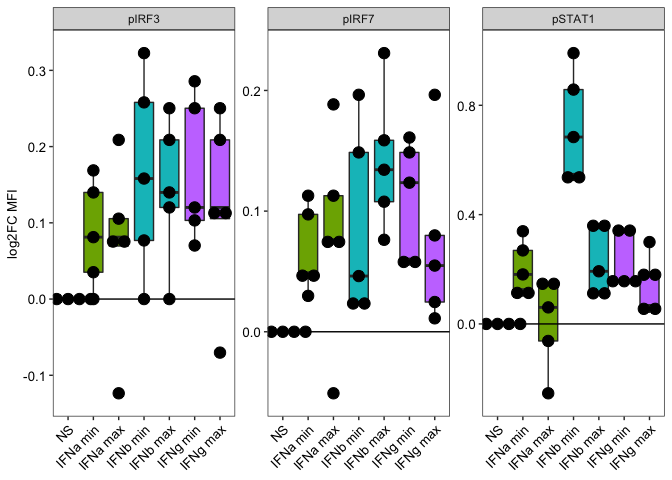

EM131 Fig5de
================
Slim FOURATI
09/19/2017

``` r
suppressPackageStartupMessages(library(package = "knitr"))
suppressPackageStartupMessages(library(package = "readxl"))
suppressPackageStartupMessages(library(package = "ggplot2"))
suppressPackageStartupMessages(library(package = "dplyr"))
suppressPackageStartupMessages(library(package = "tidyr"))
suppressPackageStartupMessages(library(package = "tibble"))
```

``` r
knitr::opts_chunk$set(echo = TRUE) # do not echo chunks
opts_chunk$set(tidy = FALSE, fig.path = "../figure/")
options(dplyr.summarise.inform = FALSE)
workDir <- dirname(getwd())
```

``` r
exp1Freq <- read_excel(path  = file.path(workDir,
                                         "input",
                                         "20170907 Exp1 and 4 RV144 IFN Raw data to Slim_Final.xlsx"),
                       sheet = 1,
                       skip  = 6) %>%
  select(-`...1`)
```

    ## New names:
    ## * `` -> ...1

``` r
exp1Freq <- exp1Freq[-seq(from = min(which(is.na(exp1Freq$donor))), to = nrow(exp1Freq)), ]
exp1Freq <- exp1Freq %>%
  gather(cname, value, -donor, -Unstim) %>%
  mutate(value  = as.numeric(value),
         Unstim = as.numeric(Unstim),
         Fold   = value/Unstim,
         Exp    = 1)
print(range(exp1Freq$value))
```

    ## [1] 0.064 7.840

``` r
exp1MFI <- read_excel(path  = file.path(workDir, 
                                        "input", 
                                        "20170907 Exp1 and 4 RV144 IFN Raw data to Slim_Final.xlsx"),
                       sheet = 1,
                       skip  = 15) %>%
  select(-`...1`) %>%
  gather(cname, value, -donor, -Unstim) %>%
  mutate(value  = as.numeric(value),
         Unstim = as.numeric(Unstim),
         Fold   = value/Unstim,
         Exp    = 1)
```

    ## New names:
    ## * `` -> ...1

``` r
print(range(exp1MFI$value))
```

    ## [1]  669 2396

``` r
exp4Freq <- read_excel(path  = file.path(workDir,
                                         "input",
                                         "20170907 Exp1 and 4 RV144 IFN Raw data to Slim_Final.xlsx"),
                       sheet = 2,
                       skip  = 6) %>%
  select(-`...1`, -`...19`)
```

    ## New names:
    ## * `` -> ...1
    ## * `` -> ...19

``` r
exp4Freq <- exp4Freq[-seq(from = min(which(is.na(exp4Freq$donor))), to = nrow(exp4Freq)), ]
exp4Freq <- exp4Freq %>%
  gather(cname, value, -donor, -Unstim) %>%
  mutate(value = gsub(pattern = "\\*", replacement = "\\1", value),
         Unstim = gsub(pattern = "\\*", replacement = "\\1", Unstim),
         value  = as.numeric(value),
         value  = pmax(value, min(setdiff(value, 0))/2),
         Unstim = as.numeric(Unstim),
         Unstim = pmax(Unstim, min(setdiff(Unstim, 0))/2),
         Fold   = value/Unstim,
         Exp    = 4)
print(range(exp4Freq$value))
```

    ## [1] 0.09 5.58

``` r
exp4MFI <- read_excel(path  = file.path(workDir,
                                        "input",
                                        "20170907 Exp1 and 4 RV144 IFN Raw data to Slim_Final.xlsx"),
                      sheet = 2,
                      skip  = 17) %>%
  select(-`...1`) %>%
  filter(!is.na(donor)) %>%
  gather(cname, value, -donor, -Unstim) %>%
  mutate(value = gsub(pattern = "\\*", replacement = "\\1", value),
         Unstim = gsub(pattern = "\\*", replacement = "\\1", Unstim),
         value  = as.numeric(value),
         Unstim = as.numeric(Unstim),
         Fold   = value/Unstim,
         Exp    = 4)
```

    ## New names:
    ## * `` -> ...1

``` r
print(range(exp4MFI$Unstim, na.rm = TRUE))
```

    ## [1]  661 3182

``` r
# merge exp1 and exp4 (p24 frequency table)
expFreq <- rbind(exp1Freq, exp4Freq) %>%
  mutate(CytokineName = gsub(pattern = "^([^ ]+) .+",
                             replacement = "\\1",
                             cname),
         CytokineConc = gsub(pattern = ".+ ([^ ]+)$",
                             replacement = "\\1",
                             cname),
         CytokineConc = gsub(pattern = "^0",
                             replacement = "0.",
                             CytokineConc))
unstimFreq <- expFreq %>%
  select(donor, Unstim, cname, Exp, CytokineName) %>%
  distinct() %>%
  mutate(value        = Unstim,
         Fold         = value/Unstim,
         CytokineConc = "Unstim",
         cname        = paste0(CytokineName, " unstim")) %>%
  select(names(expFreq))
expFreq <- rbind(expFreq, unstimFreq) %>%
  mutate(CytokineConc = factor(CytokineConc),
         CytokineConc = relevel(CytokineConc, ref = "Unstim")) 
expMFI <- rbind(exp1MFI, exp4MFI) %>%
  mutate(CytokineName = gsub(pattern = "^([^ ]+) .+",
                             replacement = "\\1",
                             cname),
         CytokineConc = gsub(pattern = ".+ ([^ ]+)$",
                             replacement = "\\1",
                             cname),
         CytokineConc = gsub(pattern = "^0",
                             replacement = "0.",
                             CytokineConc))
unstimMFI <- expMFI %>%
  select(donor, Unstim, cname, Exp, CytokineName) %>%
  distinct() %>%
  mutate(value        = Unstim,
         Fold         = value/Unstim,
         CytokineConc = "Unstim",
         cname        = paste0(CytokineName, " unstim")) %>%
  select(names(expMFI))
expMFI <- rbind(expMFI, unstimMFI) %>%
  mutate(CytokineConc = factor(CytokineConc),
         CytokineConc = relevel(CytokineConc, ref = "Unstim"))
```

``` r
# make jitter plot
plotJit <- ggplot(data    = expFreq,
                  mapping = aes(x = CytokineConc, y = log2(Fold))) +
  geom_line(mapping = aes(group = donor)) +
  geom_point(size = 1.5) +
  stat_summary(fun.y = median,
               geom = "line",
               color = "red",
               mapping = aes(group = 1),
               lwd = 2) +
  labs(x = "Concentration", y = "log2FC %CD4np24p") +
  facet_wrap(facet = ~CytokineName, nrow = 1, scale = "free") +
  geom_hline(yintercept = 0) +
  theme_bw() +
  theme(panel.grid = element_blank(),
        legend.position = "none",
        axis.text.x = element_text(color = "black", angle = 45, size = 10),
        axis.text.y = element_text(color = "black", size = 10),
        axis.title.y = element_text(color = "black", size = 10),
        axis.title.x = element_blank())
```

    ## Warning: `fun.y` is deprecated. Use `fun` instead.

``` r
print(plotJit)
```

<!-- -->

``` r
# Wilcoxon-rank
statDF <- expFreq %>%
  filter(CytokineName != "Unstim") %>%
  group_by(CytokineName, CytokineConc) %>%
  do(p = wilcox.test(x = .$value, y = .$Unstim, paired = TRUE, correct = TRUE)$p.value) %>%
  mutate(p = unlist(p))
```

    ## Warning in wilcox.test.default(x = .$value, y = .$Unstim, paired = TRUE, :
    ## cannot compute exact p-value with zeroes

    ## Warning in wilcox.test.default(x = .$value, y = .$Unstim, paired = TRUE, :
    ## cannot compute exact p-value with zeroes

    ## Warning in wilcox.test.default(x = .$value, y = .$Unstim, paired = TRUE, :
    ## cannot compute exact p-value with zeroes

``` r
filter(statDF, p <= 0.1)
```

    ## # A tibble: 11 × 3
    ## # Rowwise: 
    ##    CytokineName CytokineConc       p
    ##    <chr>        <fct>          <dbl>
    ##  1 IFNa         0.02         0.0645 
    ##  2 IFNa         0.2          0.0273 
    ##  3 IFNa         20           0.0273 
    ##  4 IFNa         200          0.00586
    ##  5 IFNb         0.02         0.00977
    ##  6 IFNb         0.2          0.0137 
    ##  7 IFNb         2            0.00977
    ##  8 IFNb         20           0.00977
    ##  9 IFNb         200          0.0625 
    ## 10 IFNg         0.05         0.0195 
    ## 11 IFNg         5            0.0840

``` r
# read phosphoflow sheet
expPF <- read_excel(path = file.path(workDir,
                                     "input",
                                     "20170907 Exp1 and 4 RV144 IFN Raw data to Slim_Final.xlsx"),
                    sheet = 4,
                    skip = 6)
```

    ## New names:
    ## * `` -> ...1
    ## * `` -> ...3
    ## * `` -> ...4
    ## * `` -> ...5
    ## * `` -> ...6
    ## * ...

``` r
# fix column name
for (i in 2:ncol(expPF)) {
  if (grepl(pattern = "\\.\\.\\.", names(expPF)[i]))
    names(expPF)[i] <- names(expPF)[(i - 1)]
}
names(expPF) <- interaction(names(expPF),
                            unlist(expPF[expPF$"...1" %in% "donor", ]))
```

    ## Warning: The `value` argument of `names<-` must be a character vector as of
    ## tibble 3.0.0.

``` r
expPF <- expPF %>%
  rename(target = ...1.donor) %>%
  filter(target != "donor") %>%
  gather(cname, value, -target) %>%
  mutate(Cytokine = gsub(pattern     = "([^\\.]+)\\..+",
                         replacement = "\\1",
                         cname),
         donor    = gsub(pattern     = ".+\\.([^\\.]+)$",
                         replacement = "\\1",
                         cname),
         Target   = gsub(pattern     = ".+ ([^ ]+)$",
                         replacement = "\\1",
                         target))
unstimPF <- expPF %>%
  filter(grepl(pattern = "NS", cname)) %>%
  select(value, donor, Target) %>%
  distinct() %>%
  rename(Unstim = value)
expPF <- merge(x = expPF, y = unstimPF, by = c("donor", "Target")) %>%
  mutate(value    = as.numeric(value),
         Unstim   = as.numeric(Unstim),
         Fold     = value/Unstim,
         CytoConc = Cytokine,
         Conc     = gsub(pattern = ".+ ([^ ]+)$",
                         replacement = "\\1",
                         Cytokine),
         Cytokine = gsub(pattern = "([^ ]+) .+",
                         replacement = "\\1",
                         Cytokine),
         Cytokine = factor(Cytokine),
         Cytokine = relevel(Cytokine, ref = "NS")) %>%
  arrange(Cytokine, desc(Conc)) %>%
  mutate(CytoConc = factor(CytoConc, levels = unique(CytoConc)))
```

``` r
# make jitter plot
plotJit <- ggplot(data    = expPF,
                  mapping = aes(x = CytoConc, y = log2(Fold))) +
  geom_boxplot(mapping = aes(fill = Cytokine), outlier.colour = NA) +
  geom_dotplot(binaxis = "y", stackdir = "center", stackgroup = TRUE,
               dotsize = 1) +
  labs(x = "Concentration", y = "log2FC MFI") +
  facet_wrap(facet = ~Target, nrow = 1, scale = "free") +
  geom_hline(yintercept = 0) +
  theme_bw() +
  theme(panel.grid = element_blank(),
        legend.position = "none",
        axis.text.x = element_text(color = "black", angle = 45, size = 10, hjust = 1),
        axis.text.y = element_text(color = "black", size = 10),
        axis.title.y = element_text(color = "black", size = 10),
        axis.title.x = element_blank())
```

    ## Warning: Ignoring unknown parameters: stackgroup

``` r
print(plotJit)
```

    ## Bin width defaults to 1/30 of the range of the data. Pick better value with `binwidth`.

<!-- -->

``` r
# Wilcoxon-rank
statDF <- expPF %>%
  group_by(Target, CytoConc) %>%
  do(p = wilcox.test(x = .$value, y = .$Unstim, paired = TRUE, correct = FALSE)$p.value) %>%
  mutate(p = unlist(p))
```

    ## Warning in wilcox.test.default(x = .$value, y = .$Unstim, paired = TRUE, :
    ## cannot compute exact p-value with zeroes

    ## Warning in wilcox.test.default(x = .$value, y = .$Unstim, paired = TRUE, :
    ## cannot compute exact p-value with ties

    ## Warning in wilcox.test.default(x = .$value, y = .$Unstim, paired = TRUE, :
    ## cannot compute exact p-value with zeroes

    ## Warning in wilcox.test.default(x = .$value, y = .$Unstim, paired = TRUE, :
    ## cannot compute exact p-value with ties

    ## Warning in wilcox.test.default(x = .$value, y = .$Unstim, paired = TRUE, :
    ## cannot compute exact p-value with ties

    ## Warning in wilcox.test.default(x = .$value, y = .$Unstim, paired = TRUE, :
    ## cannot compute exact p-value with zeroes

    ## Warning in wilcox.test.default(x = .$value, y = .$Unstim, paired = TRUE, :
    ## cannot compute exact p-value with zeroes

    ## Warning in wilcox.test.default(x = .$value, y = .$Unstim, paired = TRUE, :
    ## cannot compute exact p-value with ties

    ## Warning in wilcox.test.default(x = .$value, y = .$Unstim, paired = TRUE, :
    ## cannot compute exact p-value with zeroes

    ## Warning in wilcox.test.default(x = .$value, y = .$Unstim, paired = TRUE, :
    ## cannot compute exact p-value with ties

    ## Warning in wilcox.test.default(x = .$value, y = .$Unstim, paired = TRUE, :
    ## cannot compute exact p-value with ties

    ## Warning in wilcox.test.default(x = .$value, y = .$Unstim, paired = TRUE, :
    ## cannot compute exact p-value with ties

    ## Warning in wilcox.test.default(x = .$value, y = .$Unstim, paired = TRUE, :
    ## cannot compute exact p-value with zeroes

    ## Warning in wilcox.test.default(x = .$value, y = .$Unstim, paired = TRUE, :
    ## cannot compute exact p-value with ties

    ## Warning in wilcox.test.default(x = .$value, y = .$Unstim, paired = TRUE, :
    ## cannot compute exact p-value with ties

``` r
filter(statDF, p <= 0.1)
```

    ## # A tibble: 14 × 3
    ## # Rowwise: 
    ##    Target CytoConc      p
    ##    <chr>  <fct>     <dbl>
    ##  1 pIRF3  IFNa min 0.0656
    ##  2 pIRF3  IFNb min 0.0656
    ##  3 pIRF3  IFNb max 0.0679
    ##  4 pIRF3  IFNg min 0.0412
    ##  5 pIRF7  IFNa min 0.0422
    ##  6 pIRF7  IFNb min 0.0422
    ##  7 pIRF7  IFNb max 0.0625
    ##  8 pIRF7  IFNg min 0.0422
    ##  9 pIRF7  IFNg max 0.0625
    ## 10 pSTAT1 IFNa min 0.0625
    ## 11 pSTAT1 IFNb min 0.0625
    ## 12 pSTAT1 IFNb max 0.0625
    ## 13 pSTAT1 IFNg min 0.0422
    ## 14 pSTAT1 IFNg max 0.0625
